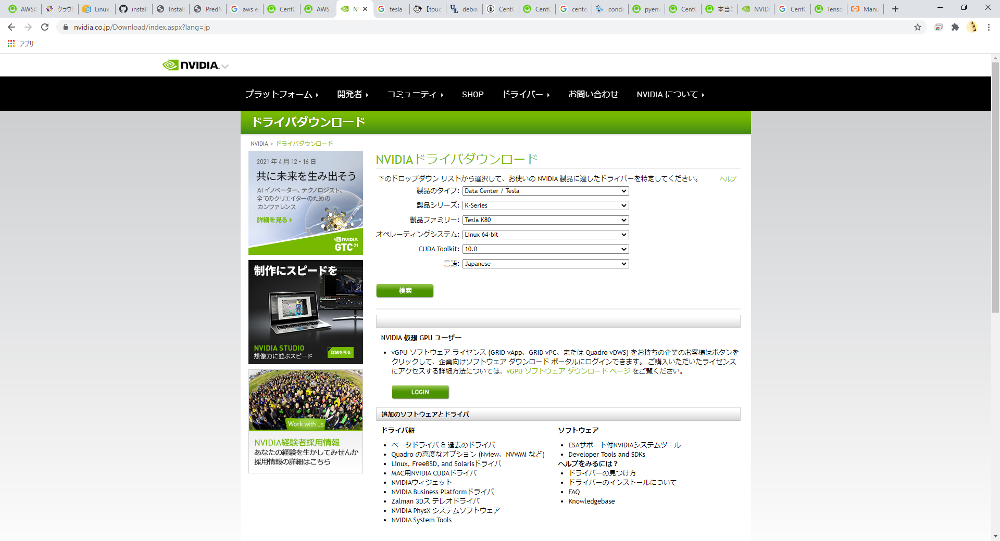
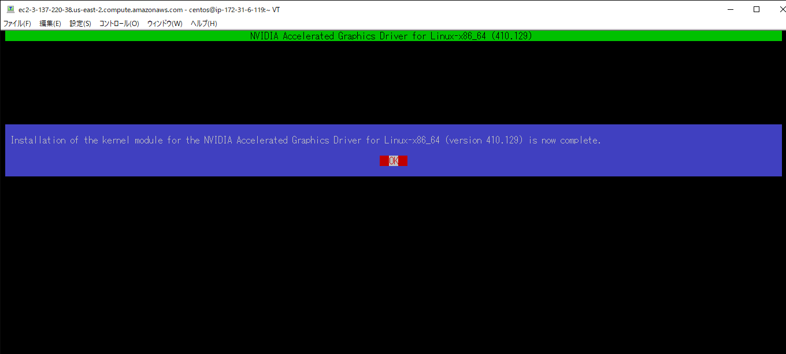
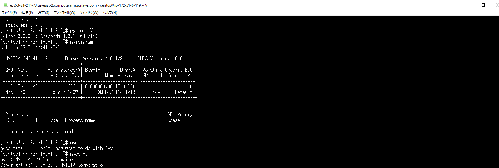
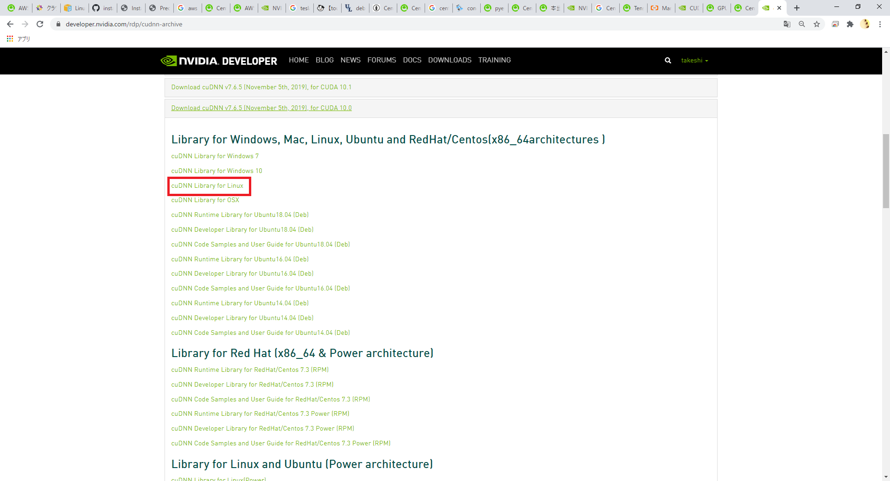
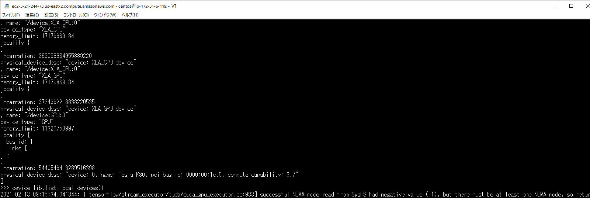

Introduction
==============
This document describes the procedures for constructing the environment and operating procedures for the system developed in the "Development of Data Compression Tools for Maintenance and Utilization of Large-scale Research Facilities".

TEZip overview
==============

This system consisits of three mechanisms.

1. Learning mechanism
2. Compression mechanism
3. Decompression mechanism

 

Learning mechanism

``````````````````

`PredNet <https://coxlab.github.io/prednet/>`_ is used to learn the change in the movement of an object over time.
According to the learning method of PredNet, the learning data is converted into the hkl format and then learned.
The learned model is output to a file. This file is used by the compression mechanism and decompression mechanism.
Use another program to download the training data and convert it to hkl.

 

Compression mechanism

``````````````````````

Using the model output by the learning mechanism, the results of inference and difference of time series images are compressed.
After deriving the difference between the original image and the inference result,error-bounded quantization, Density-based Spatial Encoding, and Partitioned Entropy Encoding are processed. These processes have the effect of increasing the compression rate when compressing.
Use the zstd library to compress and output to a binary file (.dat).

And,differences and keyframe images are also output to a binary file (.dat) using the zstd library.

 

Decompression mechanism

`````````````````````````

Using the model output by the learning mechanism and the binary file (.dat) output by the compression mechanism, the image group input to the compression mechanism is restored.
By inferring by inputting keyframes, the inference result of the compression mechanism is reproduced.
The processing of Density-based Spatial Decoding and Partitioned Entropy Decoding is performed in the reverse order of the compression mechanism, and the original difference is restored.
Since the error-bounded quantization process is lossy compression, it is not included in the decompression mechanism.
The inference result and the difference are added to restore the original image and output it.

Operating environment
========
In this case, we used AWS EC2 to build the machine.

EC2 Information
'''''''''''
* AMI
   CentOS 7.9.2009 x86_64 - ami-00f8e2c955f7ffa9b
* Instance Type
   p2.xlarge
   
Machine Information Overview
''''''''''''''''''''''''''''

* Operating Systems
   CentOS7

* CPU
   Intel(R) Xeon(R) CPU E5-2686 v4 @ 2.30GHz×4 
  
* GPU
   NVIDIA K80(12GB)
   
* Memory
   64GB

Environment construction procedure
============

Follow the steps below to build the environment.

* Install the NVIDIA driver
* Install CUDA
* Install cuDNN
* Create a virtual environment

Install the NVIDIA driver
'''''''''''''''''''''''''''''
Follow the steps below to install the driver so that you can use NVIDIA's GPU.

Disable the standard driver
..........................
You need to turn off the standard driver so that it does not interfere with the installation of the NVIDIA driver. Please execute the following command.

.. code-block:: sh

  lsmod | grep nouveau
  
Then, use a text editor such as vim to create a file in the following directory.

.. code-block:: sh

   /etc/modprobe.d/blacklist-nouveau.conf

Write the following settings in the file you created and save it.

.. code-block:: sh

   blacklist nouveau
   options nouveau modeset=0
   
Then reboot and run the following command. If nothing is displayed, the disabling has been successful.

.. code-block:: sh

   lsmod | grep nouveau
   
Running the installation
..........................
Install the package required to install the NVIDIA driver. Execute the following command.

.. code-block:: sh

   yum -y install kernel-devel kernel-devel-$(uname -r) kernel-header-$(uname -r) gcc gcc-c++ make
  
Then, check the name of your GPU device. You can check it by running the following command.

.. code-block:: sh

   lspci | grep -i nvidia

From the `NVDIA driver download page <https://www.nvidia.co.jp/Download/index.aspx?lang=jp/>`_ as shown in the following figure, select your GPU device and proceed to installation.For **CUDA Toolkit**, please select **10.0**.



Next, run the downloaded file to run the NVIDIA driver installer.The following command is an example.Please replace the file name with the one you have downloaded and run it.

.. code-block:: sh

   sh NVIDIA-Linux-x86_64-410.129-diagnostic.run
   
Select "YES" for all of the installer's selections to execute the installation.
The installation is complete when the screen shown in the following figure is displayed.



Execute the following command, and if the screen shown in the figure below is displayed, it has been installed correctly.
Select "YES" for all of the installer's selections to execute the installation.

.. code-block:: sh

   nvidia-smi



Install CUDA
'''''''''''''''''''''''''''''

Install CUDA to use the GPU in your programs.
In this case, we will use the CUDA **10.0** version.
Open `the download page <https://developer.nvidia.com/cuda-10.0-download-archive?target_os=Linux&target_arch=x86_64&target_distro=CentOS&target_version=7&target_type=rpmlocal>`_ shown in the figure below and select "Linux", "x86_64", "CentOS", "7", "rpm(local)" or "rpm(network)" to download the installer.

.. image:: ../img/img4.png

Next, run the downloaded file to run the CUDA 10.0 installer. Please run the following command.

.. code-block:: sh

   sudo yum -y install epel-release
   sudo rpm -i cuda-repo-rhel7-10-0-local-10.0.130-410.48-1.0-1.x86_64.rpm
   yum clean all
   yum install cuda

Then, run the following command to pass it through. To reflect the result, please reboot after running it.

.. code-block:: sh

   echo ' PATH=”/usr/local/cuda-10.0/bin${PATH:+:${PATH}}"' >> ~/.bashrc
   echo 'export LD_LIBRARY_PATH=”/usr/local/cuda-10.0/lib64${LD_LIBRARY_PATH:+:${LD_LIBRARY_PATH}}"' >> ~/.bashrc

After rebooting, please execute the following command. If the screen shown in the figure below appears, the software has been installed correctly.

.. code-block:: sh

   nvcc -V

.. image:: ../img/img5.png

Install cuDNN
'''''''''''''''''''''''''''''

Following CUDA, we will download cuDNN to use GPU in our programs.
You will need to create an NVIDIA account in advance. You may be asked to log in during the following procedure, so if you haven't created one, please do so at that time.
This time, we will use cuDNN **7.6.5** version.
Go to `the download page <https://developer.nvidia.com/rdp/cudnn-archive>`_ shown in the figure below and select "Download cuDNN v7.6.5 (November 5th, 2019), for CUDA 10.0" and "cuDNN Library for Linux" to download.



After the download is complete, unzip the file and place it in an appropriate location. Execute the following command.

.. code-block:: sh

   tar zxf cudnn-10.0-linux-x64-v7.6.5.32.tgz
   sudo cp -a cuda/include/* /usr/local/cuda/include/
   sudo cp -a cuda/lib64/* /usr/local/cuda/lib64/
   sudo ldconfig

Create a virtual environment
'''''''''''''''''''''''''''''

To separate the Python environment and make it easier to manage, we will use a virtual environment.
In this case, we will use "pyenv". We will install and use "anaconda" in it.


Install pyenv
..........................

Install pyenv and enable the "pyenv" command. Execute the following command and then reboot.

.. code-block:: sh

   git clone https://github.com/yyuu/pyenv.git ~/.pyenv
   echo 'export PYENV_ROOT="$HOME/.pyenv"' >> ~/.bashrc
   echo 'export PATH="$PYENV_ROOT/bin:$PATH"' >> ~/.bashrc

If you are using pyenv, use pip to install the library. This may involve unzipping the zip file, so if you do not have the zip command, you will need to install it. You can install it by running the following command

.. code-block:: sh

   yum -y install zip unzip bzip2
   
Install anaconda
..........................

Install anaconda in pyenv to create a virtual environment. You can run the command "pyenv install -l" to see a list of environments that can be installed. This time, we will use "anaconda3-4.3.1". The command to create a virtual environment is as shown below.

.. code-block:: sh

   eval "$(pyenv init -)"
   pyenv install anaconda3-4.3.1

After that, you can enter the virtual environment by executing the following command.

.. code-block:: sh

   pyenv rehash
   pyenv global anaconda3-4.3.1

Run the following command to check the version, and if you see the following message, you have entered the virtual environment.

.. code-block:: sh

   python -V
   Python 3.6.0 :: Anaconda 4.3.1 (64-bit)

Install the required libraries
..........................

After entering the environment with anaconda in pyenv, we will use pip to install the necessary libraries. First, update pip with the following command.

.. code-block:: sh

   pip install --upgrade pip
   
Next, run the following command to install the necessary libraries.

.. code-block:: sh

   pip install tensorflow-gpu==1.15
   pip install keras==2.2.4
   pip install hickle==4.0.1
   pip install numba==0.52.0
   pip install zstd==1.4.5.1
   pip install Pillow==8.0.1
   pip install scipy==1.2.0
   pip install h5py==2.10.0
   pip install cupy-cuda100==8.4.0
   pip install numpy==1.19.5

If you want to run the sample program for creating training data using Kitti data in the appendix, please install the following libraries additionally.

.. code-block:: sh

   pip install requests==2.25.1
   pip install bs4
   pip install imageio==2.9.0

If you run the following command and see "GPU" in the device_type field in the figure below, your Python program has successfully recognized the GPU.

.. code-block:: sh

   python
   # python interactive mode below
   >>> from tensorflow.python.client import device_lib
   >>> device_lib.list_local_devices()



How to solve problems that occur during environment building
'''''''''''''''''''''''''''''

Depending on the environment you are using, the previous steps may not work in some cases.
In this section, we will describe the problems we encountered while building the test environment and the solutions. If you encounter the same problem, please refer to this section.

When you run "pip install", you get an error and cannot install.
..........................

Depending on your permissions at runtime, you may get an error when you try to "pip install". This error occurs because you do not have permission to uninstall the previous version.
In this case, you can use the option "--ignore-installed" to ignore the dependency with the already installed library and install it.
An example of the command is shown below.

Cannot output files due to lack of file write permission
..........................

Depending on your permissions at runtime, you may not be able to output files from python in the virtual environment. In this case, you can run "sudo python" with administrator privileges to invoke python if it is installed outside the virtual environment.
In order to invoke python in the virtual environment from "sudo python", the following steps are required.

1. Open "/etc/sudoers" with a text editor such as vim.
2.  Add "[pyenv save location]/.pyenv" and "[pyenv save location]/.pyenv/bin" to "Default secure_path".
3.  If you are using vim, use ":wq!" to force a save, as you may get a warning and be unable to save.
4. Restart the system.

As an example of step 2, if you saved pyenv to "/home/pi", change as follows

# Before change

# After change

The GPU is recognized in Python interactive mode, but not when run in the console
..............................................................................

When running in python interactive mode, the GPU is recognized as shown in the following figure, but when executing the commands described in the next section, "Command Execution Examples and Arguments", it may be in "CPU MODE".
In this case, the NVIDIA driver may have been installed with wrong settings.
Please uninstall the NVIDIA driver and reinstall it again.
The command to uninstall the NVIDIA driver is as follows.


After executing the command, the GUI screen will appear as it did during installation, so follow the instructions to uninstall the software.
When installing again, use the installer downloaded in the section "Executing the Installation".

Operation Method
==================

In this system, "tzip.py" is the main executable program.
It switches between learning, compression, and decompression mechanisms by using different arguments.
When executing the various mechanisms, "GPU MODE" will be displayed if the GPU is correctly recognized, and "CPU MODE" will be displayed if the GPU is not recognized, automatically switching between GPU and CPU usage.
To avoid situations where programs cannot run due to the size of the GPU memory, there is also an option to force CPU mode without using the GPU.For details, please refer to the arguments of each mechanism.
In addition to "tzip.py", there is another program called "train_data_create.py" to create the training data. This should be written as well.
(There is also a sample program for creating training data using Kitti data in the appendix.If you are unable to prepare training data, please use this program).

Supported image formats
'''''''''''''''''''''''''''''

This system uses "Pillow" for loading images, which supports the following image formats (some excerpts).

* bmp
* jpg
* jpg 2000
* png
* ppm

For more information about all the formats supported by Pillow, please refer to `the Pillow documentation page  <https://pillow.readthedocs.io/en/stable/handbook/image-file-formats.html>`_

Supported image modes
''''''''''''''''''''''''''''''

Supported image modes differ between the learning mechanism and the compression/decompression mechanism, and are as follows.

**learning mechanism**

* All formats supported by Pillow (details can be found on the `Pillow documentation page <https://pillow.readthedocs.io/en/stable/handbook/concepts.html>`_)

**compression/decompression mechanism**

* RGB
* Gray Scale

As a point of caution, it is internally processed as an image in RGB mode. In other words, the learning mechanism first converts the image to RGB mode. The compression/decompression mechanism converts to RGB mode before compression and restores the original image mode after decompression.

Learning data creation program
''''''''''''''''''''''''''''''''

The training data creation program is "train_data_create.py".
Based on PredNet's training data creation program, it converts the images for training into hkl format and dumps them into a single file.

Folder Architecture
..........................

The architecture of a folder of training images should be constructed as follows.
The folders in the hierarchy enclosed by **<>** represent the time series.
The image files enclosed by **""** are the bottom level image files.
It is recommended that the image file names be numbered in chronological order so that they can be sorted and loaded in order.
When doing so, please adjust the number of digits by adding 0 at the beginning so that they are consistent.

Example: 100 images with the name "image_***.png".
"image_0000.png", "image_0001.png", "image_0002.png"... "image_0098.png", "image_0099.png", "image_0100.png
Note that if the number of digits is not unified, "10" will be loaded after "1" due to the sort order problem in python.

.. code-block:: sh
   
   The folder of input images specified by the argument
   ├─<sequence_1 >
   │     ├─"image_0000.png"
   │     ├─"image_0001.png"
   │      …
   ├─<sequence_2 >
   │     ├─"image_0000.png"
   │     ├─"image_0001.png"
   │     …
   ├─<sequence_3 >
   │     ├─"image_0000.png"
   │     ├─"image_0001.png"
   │     …
    ….
   
Running the program
..........................
 
The flow to run the training data creation program is as follows.

1. Enter the virtual environment that you created in the section "Creating a Virtual Environment".
2. Enter the src directory of this system
3. Run the Python command "train_data_create.py". (For examples and arguments, see the section below on "Command Examples and Arguments")

Example of command execution and arguments
^^^^^^^^^^^^^^^^^^^^^^^^^^^^^^^^^^^^^^^^^^^^^^^^^^^^^^^^^^^^^^^

Execute the following command

.. code-block:: sh
   
  python train_data_create.py Learning image directory Output directory
 
The meaning of each argument is as follows

.. csv-table::
   :header: "Argument", "Meaning", "Configuration example"
   :widths: 10, 25, 15
   
   "First parameter", The directory path containing the training images to be dumped into the Hkl file. ,"./data"
   "Second parameter", Directory path to output Hkl file. ,"./data_hkl"
   "-v", "| Specifies the path of the directory used for verification among the directories specified in the first argument.Without this option, randomly determined. ", "-v ./data/sequence_1"
As an execution example, the following command is used to dump to hkl.

.. code-block:: sh
   
  python train_data_create.py ./data ./data_hkl
 
Output file
..........................

The following files will be output to the specified destination directory.

* X_train.hkl
* X_val.hkl
* sources_train.hkl
* sources_val.hkl

"X_***.hkl" is the dumped image data, and "sources_***.hkl" is the saved architecture information of the directory.
Note that the file names are fixed values and are referred to by the learning mechanism, so please do not change them.

Learning mechanism
'''''''''''''''''''''''''''''

The flow to run the learning mechanism is as follows.

1. Enter the virtual environment that you created in the "Create Virtual Environment" section
2. Enter the src directory of the system
3. Run the Python command tzip.py with "-l". (See future sections for examples and arguments)

Input file
..........................

* Learning image data(X_train.hkl)
* Validation image data during training(X_val.hkl)
* Architecture information of the training image directory(sources_train.hkl)
* Architecture information of the directory of validation images during training(sources_val.hkl)

Example of command execution and arguments
....................................................

Execute the following command.

.. code-block:: sh
   
   python tezip.py -l Output directory Directory for training data

The meaning of each argument is as follows.

.. csv-table:: 
    :header: Argument name, Argument Meaning, Number of inputs, Input Meaning, Example
    :widths: 10, 15, 10, 25, 15
    
    -l,Run learning mechanism,2,"| 1：The path to the output directory of the model
    | 2：Path of the training data directory(.hkl)","| ./model
    | ./tarin_data"
    -f,Forced CPU mode flag,0,"Attaching 「-f」 to the runtime will disable the GPU and force it to run on the CPU","-f"
    -v,Flag for screen output,0,"By attaching "-v" to the runtime, the learning status, such as losses and epochs during learning, will be output to the console.","-v"

An example is shown below.

.. code-block:: sh
   
  python tezip.py -l ./model ./tarin_data

Output file
..........................

The following files will be output to the specified destination directory.

* Model structure file（prednet_model.json）
* Weighted file（prednet_weights.hdf5）

Compression mechanism
'''''''''''''''''''''''''''''

To operate the compression mechanism, perform the following steps.

1.  Enter the virtual environment that you created in the "Create Virtual Environment" section
2.  Go to the src directory of this system
3. Run the Python program "tzip.py" using the Python command with "-c". (See below for examples and arguments)


Input file
..........................

This program requires the following files, which are output by the learning mechanism.

* Model structure file output by the learning mechanism（prednet_model.json）
* Weight file of the trained model output by the learning mechanism (prednet_weights.hdf5)
* Image files to be compressed

In order to sort and load the files in order, it is recommended that the names of the image files to be compressed be numbered in chronological order.
Also, when doing so, please adjust the number of digits by adding a zero at the beginning so that the number of digits is consistent.

Example:100 images under the name of 「image_***.jpg」

「image_0000.jpg」「image_0001.jpg」「image_0002.jpg」…「image_0098.jpg」「image_0099.jpg」「image_0100.jpg」

Note that if the number of digits is not consistent, "10" will be loaded after "1" due to the sort order problem in python.

Example of command execution and arguments
..............................................................................

.. code-block:: sh
   
  python tezip.py -c  Model directory Directory of images to be compressed Output directory -p Number of warm-up sheets -w or -t [-w Number of inferences to be made from a single keyframe , -t MSE threshold for keyframe switching] -m Error-bound mechanism name -b Threshold for error bouncing mechanism

The meaning of each argument is shown in the table below.

.. csv-table::
    :header: Argument name, Argument Meaning, Number of inputs, Input Meaning, Example
    :widths: 10, 15, 10, 25, 15
   
    -c,Run the compression mechanism,3,"| 1：Path of the directory of trained models
    | 2：Directory path of the image to be compressed
    | 3：Output directory path for compressed data","| ./model
    | ./image_data
    | ./comp_data"
    -w,Specifying the keyframe switching criteria,1,"| SWP(Static Window-based Prediction)to specify how many keyframes to infer from one keyframe of execution
    | If it is specified at the same time as -t, it will cause an error termination","-w 5"
    -t,Specify the criteria for keyframe switching,1,"| Specify the threshold value of MSE(Mean Square Error) for execution switching in  DWP(Dynamic Window-based Prediction)
    | If it is specified at the same time as -w, it will cause an error termination","-t 0.02"
    -p,Number of images for warm-up,1,The more keyframes you specify for LSTM recording, the larger the "key_frame.dat" will be and the smaller the "entropy.dat" will likely be.However, if you set the number of keyframes to 0 or 1 when running DWP, the MSE will become larger and the final number of keyframes may become larger,3
    -m,Selecting an error-bound mechanism,1,"| Select the error bouncing mechanism from the following four types
    | abs：absolute error bound
    | rel：relative bound ratio
    | absrel：Do both of the above
    | pwrel：point wise relative error bound
    | If you select multiple items or select non-existent items, the program will exit with an error","| abs
    | rel
    | absrel
    | pwrel"
    -b,Threshold for error bouncing mechanism,"|  When「-m」is absrel：2
    | In other cases：1","| Specify the tolerance threshold of the error bouncing mechanism.If 「-m」 is specified as absrel, enter two values
    | First：Abs threshold
    | Second：Rel threshold
    |  If an inappropriate number of inputs are given for the one specified by  「-m」, the program will exit with an error.If the input contains 「0」, the error bouncing mechanism will not be executed and the data will be fully lossy compressed.","| -m abs -b 5
    | -m rel -b 0.1
    | -m absrel -b 5 0.1
    | -m pwrel -b 0.1"
    -f,Forced CPU mode flag,0,"By adding 「-f」 to the runtime, you can disable the GPU and force it to run on the CPU",-f
    -v,Flag for screen output,0,"When 「-v」 is added at runtime, the status during execution, such as the value of MSE after inference and the time taken for the compression process, will be output to the console",-v
    -n,Flag to disable Entropy Coding for compression process,0,"By adding 「-n」 at runtime, you can output without Entropy Coding, which is performed as a compression process, because Entropy Coding does not work effectively in some cases and may cause the image size to increase",-n

An example of execution is shown in the following command

.. code-block:: sh
   
  python tezip.py -c ./model ./image_data ./comp_data -p 3 -w 5 -m pwrel -b 0.1


Output file
..........................

The following files will be output to the specified destination directory.

* Keyframe file (key_frame.dat)
* Difference between the real image and the inferred result (entropy.dat)
* A text file (filename.txt) in which the name of the image before compression is recorded.

Do not change the file name, as it will be referenced by the decompression mechanism with a fixed value.

Decompression mechanism
'''''''''''''''''''''''''''''''''''''''''''''''''''''''''''''''''''''''''''''''''''''''

The flow to run the decompression mechanism is as follows.

1. Enter the virtual environment that you created in the "Create Virtual Environment" section
2. Enter the src directory of this system
3. Run the Python program tzip.py using the Python command with 「-u」 (See the section below for execution examples and arguments)

Input file
..........................

This program requires the following files output by the learning and compression mechanisms.

* Output from the learning mechanism
   
  * Model structure file (prednet_model.json)
  * Trained model weights file (prednet_weights.hdf5)

* Output of the compression mechanism

  * Keyframe file (key_frame.dat)
  * Difference between real image and inference result (entropy.dat)
  * Text file containing the name of the image before compression (filename.txt)

Example of command execution and arguments
..............................................................................

Please execute the following command.

.. code-block:: sh
   
  python tezip.py -u Model directory Directory of compressed data Output directory

The meaning of each argument is shown in the table below.

.. csv-table::
    :header:  Argument name, Argument Meaning, Number of inputs, Input Meaning, Example
    :widths: 10, 15, 10, 25, 15
   
    -u,Run the learning mechanism,3,"| 1：Directory path of trained models
    | 2：Directory path for compressed data (.dat), etc.
    | 3：Output directory path for unzipped data","| ./model
    | ./comp_data
    | ./uncomp_data"
    -f,Forced CPU mode flag,0,"By adding 「-f」 to the runtime, you can disable the GPU and force it to run on the CPU.","-f"
    -v,Flag for screen output,0,"By adding 「-v」 at runtime, the processing time during decompression is output to the console","-v"

An example of how to do this is shown below.

.. code-block:: sh
   
  python tezip.py -u ./model ./comp_data ./uncomp_data

Output file
..........................

The following files will be output to the specified destination directory

* Compressed images: Group of files


Appendix
=============

A sample program for creating training data using Kitti data
'''''''''''''''''''''''''''''''''''''''''''''''''''''''''''''''''''''''''''''''''''''''''''''''''''''''''''''''''''''''''''''''''''''''''''''''''''''''''''''''''''''''''''''''''''''''''''''

The sample program for creating training data is "kitti_train_data_create.py".
Based on PredNet's training data creation program, it dumps a large number of images from the kitti data set into a single file in hkl format for training.

System Overview
....................................


The learning data creation program consists of the following three blocks

* Login to the kitti site
* Downloading and decompression of image data
* Dumping the data (converted to hkl files)

Downloading the kitti dataset requires registration on the `kitti site <https://www.cvlibs.net/datasets/kitti/user_register.php>`_. Please register as a user in advance.
When running the program, you need to specify the email address and password you used when registering.

Downloading the data requires about 200GB of space. The breakdown is 165 GB for the zip file immediately after downloading, and 30 GB after unzipping.
Dumping the data requires 42128 images of size 1248×376 to be stored in memory if the data is run as it is after downloading. Depending on the environment, the following error may occur due to insufficient memory.
In this case, please reduce the number of images before executing the program.

.. code-block:: sh
   
  numpy.core._exceptions.MemoryError: Unable to allocate 55.2 GiB for an array with shape (42128, 376, 1248, 3) and data type uint8

Folder Architecture
....................................................

The architecture of the downloaded kitti data looks like the following.
The folders in the hierarchy surrounded by <> represent a single time series.
The "city", "residential" and "road" are the categories of the kitti data. There is no particular impact on the use of this data in PredNet.
If you want to reduce the data, please delete it from the folder surrounded by <>.
However, please do not delete "city/2011_09_26_drive_0005_sync" as it is assigned to the validation data being trained.
When replacing the data, replace only the bottom layer of image files enclosed in "", and leave the folder structure as it is.
If you want to add new data, please create a similar hierarchical structure of folders and add them from the red.

.. code-block:: sh
   
   raw
   ├─city
   │    ├─<2011_09_26_drive_0001_sync>
   │    │    └─2011_09_26
   │    │         └─2011_09_26_drive_0001_sync
   │    │              └─image_03
   │    │                   └─data
   │    │                        ├─"0000000000.png"
   │    │                        ├─"0000000001.png"
   │    │                         …
   │    ├─<2011_09_26_drive_0002_sync>
   │     …
   ├─residential
   │    ├─<2011_09_26_drive_0001_sync>
   │     …
   └─road
      ├─<2011_09_26_drive_00015_sync>
          …

Run the program
..........................

The flow of executing the learning data creation program is as follows.

1. Enter the virtual environment that you created in the "Create Virtual Environment" section
2. Enter the src directory of this system
3. Use the Python command to run the Python program kitti_train_data_create.py. (For execution examples and arguments, see the "Command execution examples and arguments" section below)

Example of command execution and arguments
^^^^^^^^^^^^^^^^^^^^^^^^^^^^^^^^^^^^^^^^^^^^^^^^

Execute the following command.

.. code-block:: sh

   python kitti_train_data_create.py Output directory -d <e-mail address> <password> -p

The meaning of each argument is shown in the table below.

.. csv-table::
    :header: Argument name, Argument Meaning,Number of inputs, Input Meaning, example
    :widths: 10, 15, 10, 25, 15
   
    First quotation,Directory path to output Hkl file, \-, \-, ./data
    -d,Flag to download the Kitti data set, 2, "| 1：Email address registered on the kitti site
    | 2：password registered on the kitti site", -d tezip@tezip.com nfoe2fjep233af
    -p,Flag for processing a group of image data to change to hkl.The output directory of -d and the input/output directory of -p are common,0, \-,-p

As an execution example, if you want to download the data and dump it directly to hkl, you can use the following command.

.. code-block:: sh

   python kitti_train_data_create.py ./data -d tezip@tezip.com nfoe2fjep233af -p

Output file
..........................

The following files will be output to the specified destination directory.

* Download and extract the image data
 
  * raw.zip
  * raw directory (see section "Folder Architecture" for an overview of the contents)

* Dump the data (converted to hkl files)
 
  * X_train.hkl
  * X_val.hkl
  * sources_train.hkl
  * sources_val.hkl

"X_***.hkl" is a dump file of image data, and "sources_***.hkl" is a file of directory architecture information.
Please do not change the file name, as it will be referred to by the learning mechanism with a fixed value.
