.. TEZip documentation master file, created by
   sphinx-quickstart on Thu Aug 12 16:14:39 2021.
   You can adapt this file completely to your liking, but it should at least
   contain the root `toctree` directive.

Welcome to TEZip's documentation!
=================================

.. toctree::
   :maxdepth: 2
   :caption: Contents:

Indices and tables
==================

* :ref:`genindex`
* :ref:`modindex`
* :ref:`search`

はじめに
==============
本ドキュメントは、「大規模研究施設の整備・利活用のためのデータ圧縮ツール開発」（以下本件）において開発したシステムの環境構築手順及び操作手順について説明するものです。

システム概要
============
本システムは、以下3つの機構からなります。

* 学習機構
* 圧縮機構
* 解凍機構

学習機構
'''''''''
`PredNet <https://coxlab.github.io/prednet/>`_ を使用して時間経過によって物体が動く変化の学習を行います。
PredNetの学習方法に従い学習データをhkl形式に変換してから学習を行います。
学習したモデルをファイルに出力し、圧縮機構・解凍機構で使用します。
学習データのダウンロード・hklへの変換は別途プログラムを使用して用意します。
詳しくは5.2で説明します。

圧縮機構
''''''''''''''''''''''
学習機構で出力したモデルを使用して、時系列画像群を推論・差分を圧縮します。
元画像と推論結果の差分を求め、error-bounded quantization、Density-based Spatial Encoding、Partitioned Entropy Encodingの処理を施します。これらの処理は最終的に圧縮する時に圧縮率を高める効果があります。
圧縮にはzstdライブラリを使用してバイナリファイル(.dat)に出力します。
また、差分だけでなくキーフレーム画像もzstdを使用してバイナリファイル(.dat)に出力します。

解凍機構
''''''''''''''''''''''
学習機構で出力したモデルと圧縮機構で出力したバイナリファイル(.dat)を使用して、圧縮機構に入力した画像群を復元します。
キーフレームを入力として推論を行い、圧縮機構の推論結果を再現します。
Density-based Spatial Decoding、Partitioned Entropy Decodingの処理を圧縮機構の逆順に施すことで、元の差分を復元します。error-bounded quantizationの処理は非可逆圧縮になるため、解凍機構には含まれません。
推論結果と差分を足し合わせることで、元画像を復元し、出力します。

動作環境
========
今回はマシンの構築にAWSのEC2を使用しました。

EC2情報
'''''''''''
* AMI
   CentOS 7.9.2009 x86_64 - ami-00f8e2c955f7ffa9b
* インスタンスタイプ
   p2.xlarge
   
マシン情報概要
''''''''''''''

* 動作OS
   CentOS7

* 動作CPU
   Intel(R) Xeon(R) CPU E5-2686 v4 @ 2.30GHz×4 
  
* 動作GPU
   NVIDIA K80(12GB)
   
* 動作メモリ
   64GB

環境構築手順
============

以下の手順で環境構築を行います

* NVIDIAドライバのインストール
* CUDAのインストール
* cuDNNのインストール
* 仮想環境の作成

NVIDIAドライバのインストール
'''''''''''''''''''''''''''''
NVIDIAのGPUを使用できるようにドライバを以下の手順に従ってインストールします。

標準ドライバの無効化
..........................
NVIDIAドライバのインストールの邪魔をしないように標準ドライバを切る必要があります。以下のコマンドを実行してください。

.. code-block:: sh

  lsmod | grep nouveau
  
その後、vimなどのテキストエディタを使用して以下のディレクトリにファイルを作成してください。

.. code-block:: sh

   /etc/modprobe.d/blacklist-nouveau.conf

作成したファイルには以下を記述して保存します。

.. code-block:: sh

   blacklist nouveau
   options nouveau modeset=0
   
 その後再起動をして、以下のコマンドを入力します。何も表示されなければ、無効化に成功しています。

.. code-block:: sh

   lsmod | grep nouveau
   
インストールの実行
..........................
NVIDIAドライバのインストールに必要なパッケージをインストールします。以下のコマンドを実行してください。

.. code-block:: sh

   yum -y install kernel-devel kernel-devel-$(uname -r) kernel-header-$(uname -r) gcc gcc-c++ make
  
次に自分のGPUデバイスの名前を確認します。以下のコマンドを実行して確認できます。

.. code-block:: sh

   lspci | grep -i nvidia

以下の図のような `NVDIAドライバダウンロードのページ <https://www.nvidia.co.jp/Download/index.aspx?lang=jp/>`_ から自分のGPUデバイスを選択してインストールに進みます。「CUDA Toolkit」については「10.0」を選択してください。

.. image:: ./img/img1.png

次にダウンロードしたファイルを実行してNVIDIAドライバのインストーラを実行します。以下のコマンドは一例になります。ダウンロードしたファイル名に置き換えて実行してください。

.. code-block:: sh

   sh NVIDIA-Linux-x86_64-410.129-diagnostic.run
   
インストーラの選択に対して全て「YES」を選択してインストールを実行します。
以下の図のような画面が表示されていればインストール完了となります。

.. image:: ./img/img2.png

以下のコマンドを実行して、以下の図のような画面が表示されれば、正しくインストールされています。

.. code-block:: sh

   nvidia-smi

.. image:: ./img/img3.png

CUDAのインストール
'''''''''''''''''''''''''''''

GPUをプログラムで使用するためにCUDAをインストールします。
今回は、CUDA **10.0** のバージョンを使用します。
以下の図のような `ダウンロードページ <https://developer.nvidia.com/cuda-10.0-download-archive?target_os=Linux&target_arch=x86_64&target_distro=CentOS&target_version=7&target_type=rpmlocal>`_ を開き「Linux」「x86_64」「CentOS」「7」「rpm(local) または rpm(network)」を選択してインストーラのダウンロードを行ってください。

.. image:: ./img/img4.png

次にダウンロードしたファイルを実行してCUDA10.0のインストーラを実行します。以下のコマンドを実行してください。

.. code-block:: sh

   sudo yum -y install epel-release
   sudo rpm -i cuda-repo-rhel7-10-0-local-10.0.130-410.48-1.0-1.x86_64.rpm
   yum clean all
   yum install cuda

その後、以下のコマンドを実行してパスを通します。結果を反映するために、実行した後は再起動をしてください。

.. code-block:: sh

   echo ' PATH=”/usr/local/cuda-10.0/bin${PATH:+:${PATH}}"' >> ~/.bashrc
   echo 'export LD_LIBRARY_PATH=”/usr/local/cuda-10.0/lib64${LD_LIBRARY_PATH:+:${LD_LIBRARY_PATH}}"' >> ~/.bashrc

再起動した後は以下のコマンドを実行してください。以下の図のような画面が表示されれば、正しくインストールされています。

.. code-block:: sh

   nvcc -V

.. image:: ./img/img5.png

cuDNNのインストール
'''''''''''''''''''''''''''''

CUDAに引き続きGPUをプログラムで使用するためにcuDNNをダウンロードします。
なお、こちらについてはあらかじめNVIDIAアカウントを作成する必要があります。下記手順の途中でログインを要求されることがあるので未作成の場合は、そのタイミング作成してください。
今回はcuDNN **7.6.5** のバージョンを使用します。
以下の図のような `ダウンロードページ <https://developer.nvidia.com/rdp/cudnn-archive>`_ を開き、「Download cuDNN v7.6.5 (November 5th, 2019), for CUDA 10.0」「cuDNN Library for Linux」を選択してダウンロードしてください。

.. image:: ./img/img6.png

ダウンロードが完了したら、解凍してファイルを適当な場所に配置します。以下のコマンドを実行してください。

.. code-block:: sh

   tar zxf cudnn-10.0-linux-x64-v7.6.5.32.tgz
   sudo cp -a cuda/include/* /usr/local/cuda/include/
   sudo cp -a cuda/lib64/* /usr/local/cuda/lib64/
   sudo ldconfig
   
仮想環境の作成
'''''''''''''''''''''''''''''

Python環境を切り分け、管理しやすくするため、仮想環境を使用します。
今回は「pyenv」を使用して、その中に「anaconda」をインストールして使用します。

pyenvのインストール
..........................

pyenvをインストールして「pyenv」コマンドを有効にします。以下のコマンドを実行した後、再起動をしてください。

.. code-block:: sh

   git clone https://github.com/yyuu/pyenv.git ~/.pyenv
   echo 'export PYENV_ROOT="$HOME/.pyenv"' >> ~/.bashrc
   echo 'export PATH="$PYENV_ROOT/bin:$PATH"' >> ~/.bashrc

pyenvを使用する場合は、pipを使用してライブラリをインストールします。その際にzipファイルの解凍を行う場合があるため、zipコマンドがない場合はインストールしておく必要があります。以下のコマンドを実行してインストールできます。

.. code-block:: sh

   yum -y install zip unzip bzip2
   
anacondaのインストール
..........................

pyenvの中にanacondaをインストールして仮想環境を作成します。「pyenv install -l」でインストールできる環境の一覧を表示できます。今回は「anaconda3-4.3.1」を使用します。仮想環境作成のコマンドは以下になります。

.. code-block:: sh

   eval "$(pyenv init -)"
   pyenv install anaconda3-4.3.1

その後、以下のコマンドで仮想環境に入ります。

.. code-block:: sh

   pyenv rehash
   pyenv global anaconda3-4.3.1

以下のバージョンを確認するコマンドを実行して、以下の表示が確認できれば仮想環境に入れています。

.. code-block:: sh

   python -V
   Python 3.6.0 :: Anaconda 4.3.1 (64-bit)

必要なライブラリのインストール
..........................

pyenv + anacondaで環境に入った後は、pipを使用して必要なライブラリをインストールします。まずは以下のコマンドでpipのアップデートをします。

.. code-block:: sh

   pip install --upgrade pip
   
次に以下のコマンドで必要なライブラリをインストールします。

.. code-block:: sh

   pip install tensorflow-gpu==1.15
   pip install keras==2.2.4
   pip install hickle==4.0.1
   pip install numba==0.52.0
   pip install zstd==1.4.5.1
   pip install Pillow==8.0.1
   pip install scipy==1.2.0
   pip install h5py==2.10.0
   pip install cupy-cuda100==8.4.0
   pip install numpy==1.19.5

付録のKittiデータを使用した学習データ作成のサンプルプログラムを動かす場合には、以下のライブラリを追加でインストールしてください。

.. code-block:: sh

   pip install requests==2.25.1
   pip install bs4
   pip install imageio==2.9.0

以下のコマンドを実行して以下の図のようにdevice_typeに”GPU”がある場合は、pythonプログラムからGPUを認識することに成功しています。

.. code-block:: sh

   python
   # 以下pythonの対話モード
   >>> from tensorflow.python.client import device_lib
   >>> device_lib.list_local_devices()

.. image:: ./img/img7.png

環境構築で発生する不具合に対するヘルプ
'''''''''''''''''''''''''''''

環境によっては、これまでの記述内容だけではうまくいかないケースがあります。
ここではテスト用環境構築中に起きた不具合と、その対応策について記述します。同様の不具合が発生した場合は参考にしてください。

pip installでエラーが発生してインストールできない
..........................

実行時の権限の状態によっては、「pip install」をしたときにエラーが起こる場合があります。pipが既存のライブラリとの依存関係を調べアップデートしようとします。その際に、前のバージョンをアンインストールする権限が無いため、起こるエラーです。
その場合には「--ignore-installed」をオプションに付けることで、インストール済みのライブラリとの依存関係を無視してインストールすることができます。
コマンド例としては以下の通りです

.. code-block:: sh

   pip install tensorflow-gpu==1.15 --ignore-installed

ファイル書き込み権限が無くファイルを出力できない
..........................

実行時の権限の状態によっては、仮想環境のpythonからファイルの出力が行えない場合があります。その際、「sudo python」で管理者権限で実行すると、仮想環境以外にpythonがインストールされている場合、そちらが呼び出されます。
「sudo python」から仮想環境のpythonを呼び出すためには以下の手順が必要になります。

1. vimなどで「/etc/sudoers」を開く
2. Default secure_pathに「pyenv保存場所/.pyenv」と「pyenv保存場所/.pyenv/bin」を追加する
3. 注意が出て保存できない場合があるため、vimの場合「:wq!」で強制的に保存する
4. 再起動する

手順2の例として、pyenvを「/home/pi」に保存した場合は以下のように変更します。

.. code-block:: sh
   
   #変更前
   Default secure_path="/usr/local/sbin:/usr/local/bin:/usr/sbin:/usr/bin:/sbin:/bin"
   
   #変更後
   Default secure_path="/home/pi/.pyenv/shims:/home/pi/.pyenv/bin:/usr/local/sbin:/usr/local/bin:/usr/sbin:/usr/bin:/sbin:/bin"

Pythonの対話モードでGPUを認識するのにコンソール実行では認識しない
..............................................................................

pythonの対話モードで実行した場合は図 7のようにGPUを認識しているのに、5.3.2，5.4.2，5.5.2を実行した際に「CPU MODE」になってしまう場合があります。その際はNVIDIAドライバが誤った設定でインストールされてしまっている可能性があります。一度NVIDIAドライバをアンインストールして、再度インストールし直してください。
NVIDIAドライバをアンインストールするコマンドは以下になります。

.. code-block:: sh
   
  sudo /usr/bin/nvidia-uninstall
  
コマンドを実行すると、インストール時と同様にGUI式の画面になるため、指示に従ってアンインストールしてください。再度インストールする際は4.1.2でダウンロードしたインストーラを使用してください。

操作方法
============

本システムは「tezip.py」が実行プログラムの本体となります。
引数の使い分けによって、学習機構・圧縮機構・解凍機構の実行を切り替えます。
各種機構実行時に正しくGPUを認識している場合は「GPU MODE」、GPUを認識していない場合は「CPU MODE」という表示がされ、GPU・CPUの使用を自動で切り替えます。GPUメモリのサイズの関係プログラムが動かせなくなる状況を回避するために、GPUを使用しない強制CPUモードにするオプションもあります。詳しくはそれぞれの機構の引数の説明を参照してください。
また、「tezip.py」とは別に、「train_data_create.py」という学習データ作成プログラムがあります。こちらも合わせて記述します。(付録にKittiデータを使用した学習データ作成のサンプルプログラムもあります。学習データを用意できない場合は、こちらを使用してください。)

対応画像のフォーマット
'''''''''''''''''''''''''''''

本システムでは画像の読み込みに「Pillow」を使用しています。Pillowでは以下のような画像が対応フォーマットとしてあります(一部抜粋)。

* bmp
* jpg
* jpg 2000
* png
* ppm

「Pillow」が対応している全てのフォーマットについては　`Pillowのドキュメントページ <https://pillow.readthedocs.io/en/stable/handbook/image-file-formats.html>`_ より確認できます。

学習データ作成プログラム
'''''''''''''''''''''''''''''

学習データ作成プログラムは「train_data_create.py」になります。PredNetの学習データ作成プログラムに基づき、学習用の画像をhkl形式にして、一つのファイルにダンプします。

フォルダのアーキテクチャ
..........................

学習用画像のフォルダのアーキテクチャは以下のようにしてください。
**<>** で囲まれた階層のフォルダが一つの時系列を表しています。
**""** で囲まれた画像ファイルが、最下層の画像ファイルになります。ソートして順番に読み込むため、画像ファイル名は時系列順に数字を付けることをお勧めします。またその際、数字の桁数が統一されるように、頭に0を付けて調整してください。

例：「image_***.png」という名前で100枚の画像
「image_0000.png」「image_0001.png」「image_0002.png」…「image_0098.png」「image_0099.png」「image_0100.png」
桁数が統一されていない場合、pythonのソート順の問題で「1」の次に「10」が読み込まれてしまいますので注意してください。

.. code-block:: sh
   
   引数で指定した入力画像のフォルダ
   ├─<sequence_1 >
   │     ├─"image_0000.png"
   │     ├─"image_0001.png"
   │      …
   ├─<sequence_2 >
   │     ├─"image_0000.png"
   │     ├─"image_0001.png"
   │     …
   ├─<sequence_3 >
   │     ├─"image_0000.png"
   │     ├─"image_0001.png"
   │     …
    ….

プログラムの実行
..........................

学習データ作成プログラムを実行する流れは以下の通りです。

1. 「仮想環境の作成」のセクションで作成した仮想環境に入ります
2. 本システムのsrcディレクトリに入ります
3. Pythonコマンドでtrain_data_create.pyを実行します。(実行例や引数については以下の「コマンドの実行例と引数」のセクションを参照)

コマンドの実行例と引数
^^^^^^^^^^^^^^^^^^^^^

以下のコマンドを実行してください

.. code-block:: sh
   
  python train_data_create.py 学習用画像ディレクトリ 出力ディレクトリ
 
各引数の意味は以下の通りです。

.. csv-table:: 
   :header: "引数", "意味", "設定例"
   :widths: 10, 25, 15

   "第一引数", Hklファイルにダンプしたい学習用画像が入ったディレクトリパス ,"./data"
   "第二引数", Hklファイルの出力先のディレクトリパス ,"./data_hkl"

実行例として、hklへのダンプを行う場合は以下のコマンドになります。

.. code-block:: sh
   
  python train_data_create.py ./data ./data_hkl
  
出力ファイル
..........................

以下のファイルが指定した出力先ディレクトリに出力されます。

* X_train.hkl
* X_val.hkl
* sources_train.hkl
* sources_val.hkl

「X_***.hkl」は画像データをダンプしたもの、「sources_***.hkl」はディレクトリのアーキテクチャ情報を保存したものになります。
なお、ファイル名は固定値で学習機構から参照されるため、変更しないでください。

学習機構
'''''''''''''''''''''''''''''

学習機構を動かすための流れは以下の通りです。

1. 「仮想環境の作成」の項目で作成した仮想環境に入ります
2. 本システムのsrcディレクトリに入ります
3. Pythonコマンドでtezip.pyを「-l」を入れて実行します。(実行例や引数については参照)

入力ファイル
..........................

* 学習画像データ(X_train.hkl)
* 学習中の検証画像データ(X_val.hkl)
* 学習画像のディレクトリのアーキテクチャ情報(sources_train.hkl)
* 学習中の検証画像のディレクトリのアーキテクチャ情報(sources_val.hkl)

コマンドの実行例と引数
..........................

以下のコマンドを実行してください。

.. code-block:: sh
   
   python tezip.py -l 出力ディレクトリ 学習用データのディレクトリ

各引数の意味は以下の通りです。

.. csv-table:: 
    :header: 引数名, 引数の意味, 入力の数, 入力の意味, 例
    :widths: 10, 15, 10, 25, 15
    
    -l,学習機構を実行,2,"| 1：モデルの出力先ディレクトリのパス
    | 2：学習用データ(.hkl)ディレクトリのパス","| ./model
    | ./tarin_data"
    -f,強制CPUモードのフラグ,0,"「-f」を実行時につけることで、GPUを無効化し、強制的にCPUで実行します","-f"
    -v,画面出力のフラグ,0,"「-v」を実行時につけることで、学習中のlossやエポックなどの学習状況をコンソールに出力します","-v"

実行例は以下の通りです

.. code-block:: sh
   
  python tezip.py -l ./model ./tarin_data

出力ファイル
..........................

以下のファイルが指定した出力先ディレクトリに出力されます。

* モデル構造ファイル（prednet_model.json）
* 重みファイル（prednet_weights.hdf5）
 
圧縮機構
'''''''''''''''''''''''''''''

圧縮機構を動かすための流れは以下の通りです。

1. 「仮想環境の作成」の項目で作成した仮想環境に入ります
2. 本システムのsrcディレクトリに入ります
3. Pythonコマンドでtezip.pyを「-c」を入れて実行します。(実行例や引数については参照)

入力ファイル
..........................

本プログラムでは、学習機構によって出力された以下のファイルが必要です。

* 学習機構によって出力されたモデル構造ファイル（prednet_model.json）
* 学習機構によって出力された学習済みモデルの重みファイル（prednet_weights.hdf5）
* 圧縮対象の画像ファイル群

ソートして順番に読み込むため、圧縮対象の画像ファイル名は時系列順に数字を付けることをお勧めします。またその際、数字の桁数が統一されるように、頭に0を付けて調整してください。
例：「image_***.jpg」という名前で100枚の画像
「image_0000.jpg」「image_0001.jpg」「image_0002.jpg」…「image_0098.jpg」「image_0099.jpg」「image_0100.jpg」
桁数が統一されていない場合、pythonのソート順の問題で「1」の次に「10」が読み込まれてしまいますので注意してください。

コマンドの実行例と引数
..........................

.. code-block:: sh
   
  python tezip.py -c モデルのディレクトリ 圧縮対象画像のディレクトリ 出力ディレクトリ -p ウォームアップ枚数 -wまたは-t  [-w 1枚のキーフレームから推論する枚数 ,-t キーフレーム切り替えのMSEの閾値]  -m エラーバウンド機構名 -b エラーバウンド機構の閾値

各引数の意味は以下の通りです。

.. csv-table:: 
    :header: 引数名, 引数の意味, 入力の数, 入力の意味, 例
    :widths: 10, 15, 10, 25, 15
    
    -c,圧縮機構を実行,3,"| 1：学習済みモデルのディレクトリのパス
    | 2：圧縮対象画像のディレクトリのパス
    | 3：圧縮データの出力先ディレクトリのパス","| ./model
    | ./image_data
    | ./comp_data"
    -w,キーフレーム切り替えの基準の指定,1,"| SWP(Static Window-based Prediction)で実行1枚のキーフレームから何枚推論するかを指定
    | -tと同時に指定した場合はエラー終了となる","-w 5"
    -t,キーフレーム切り替えの基準の指定,1,"| DWP(Dynamic Window-based Prediction)で実行切り替えの基準となるMSE(Mean Square Error)の閾値を指定
    | -wと同時に指定した場合はエラー終了となる","-t 0.02"
    -p,ウォームアップの画像枚数,1,LSTMの記録用に、最初にキーフレームから連続で推論する枚数の指定枚数が多いほどkey_frame.datのサイズが大きくなり、entropy.datのサイズが小さくなる可能性が高くなります。ただし、DWPで実行した際に、0や1にすると、MSEが大きくなり、逆に最終的なキーフレーム数が多くなってしまう可能性があります。,3
    -m,エラーバウンド機構の選択,1,"| エラーバウンド機構の選択以下の4種から選択します
    | abs：absolute error bound
    | rel：relative bound ratio
    | absrel：上記2つを両方実行
    | pwrel：point wise relative error bound
    | 複数選択したり、存在しないものを選択したりした場合はエラー終了します","| abs
    | rel
    | absrel
    | pwrel"
    -b,エラーバウンド機構の閾値,"| 「-m」がabsrelの場合：2
    | それ以外の場合：1","| エラーバウンド機構の許容範囲の閾値を指定「-m」でabsrelを指定した場合は値を2つ入力します。
    | 1つ目：absの閾値
    | 2つ目：relの閾値
    | それ以外は値を1つ入力します。「-m」で指定したものに適切でない個数の入力が与えられた場合はエラー終了します。入力に「0」が含まれている場合はエラーバウンド機構は実行されず、完全非可逆圧縮のデータとなります","| -m abs -b 5
    | -m rel -b 0.1
    | -m absrel -b 5 0.1
    | -m pwrel -b 0.1"
    -f,強制CPUモードのフラグ,0,「-f」を実行時につけることで、GPUを無効化し、強制的にCPUで実行します,-f
    -v,画面出力のフラグ,0,「-v」を実行時につけることで、推論後のMSEの値や圧縮処理にかかった時間など実行中の状況をコンソールに出力します,-v
    -n,圧縮処理のEntropy Codingを無効にするフラグ,0,「-n」を実行時につけることで、圧縮処理として実行されるEntropy Codingを行わずに出力します。Entropy Codingは場合によっては有効に働かず、逆に画像サイズが大きくなる場合が発生する可能性があるためです,-n

実行例は以下の通りです

.. code-block:: sh
   
  python tezip.py -c ./model ./image_data ./comp_data -p 3 -w 5 -m pwrel -b 0.1

出力ファイル
..........................

以下のファイルが指定した出力先ディレクトリに出力されます。

* キーフレームファイル（key_frame.dat）
* 実画像と推論結果の差分（entropy.dat）
* 圧縮前の画像名が記録されたテキストファイル(filename.txt)

ファイル名は、固定値で解凍機構から参照されるため、変更しないでください。

解凍機構
'''''''''''''''''''''''''''''

解凍機構を動かすための流れは以下の通りです。

1. 「仮想環境の作成」の項目で作成した仮想環境に入ります
2. 本システムのsrcディレクトリに入ります
3. Pythonコマンドでtezip.pyを「-u」を入れて実行します。(実行例や引数については参照)

入力ファイル
..........................

本プログラムでは、学習機構・圧縮機構によって出力された以下のファイルが必要です。

* 学習機構の出力
   
  * モデル構造ファイル（prednet_model.json）
  * 学習済みモデルの重みファイル（prednet_weights.hdf5）

* 圧縮機構の出力

  * キーフレームファイル（key_frame.dat）
  * 実画像と推論結果の差分（entropy.dat）
  * 圧縮前の画像名が記録されたテキストファイル(filename.txt)

コマンドの実行例と引数
..........................

以下のコマンドを実行してください。

.. code-block:: sh
   
  python tezip.py -u モデルのディレクトリ 圧縮データのディレクトリ 出力ディレクトリ

各引数の意味は以下の通りです。

.. csv-table:: 
    :header: 引数名, 引数の意味, 入力の数, 入力の意味, 例
    :widths: 10, 15, 10, 25, 15
    
    -u,学習機構を実行,3,"| 1：学習済みモデルのディレクトリのパス
    | 2：圧縮データ(.dat)等のディレクトリのパス
    | 3：解凍データの出力先ディレクトリのパス","| ./model
    | ./comp_data
    | ./uncomp_data"
    -f,強制CPUモードのフラグ,0,"「-f」を実行時につけることで、GPUを無効化し、強制的にCPUで実行します","-f"
    -v,画面出力のフラグ,0,"「-v」を実行時につけることで、解凍中の処理時間をコンソールに出力します","-v"
    
実行例は以下の通りです。

.. code-block:: sh
   
  python tezip.py -u ./model ./comp_data ./uncomp_data

出力ファイル
..........................

以下のファイルが指定した出力先ディレクトリに出力されます。

* 圧縮した画像ファイル群

付録
=============

Kittiデータを使用した学習データ作成のサンプルプログラム
'''''''''''''''''''''''''''''''''''''''''''''''''''''''''''''''

学習データ作成のサンプルプログラムは「kitti_train_data_create.py」になります。PredNetの学習データ作成プログラムに基づき、kittiデータセットの大量の画像を学習用のhkl形式にして、一つのファイルにダンプします。

システム概要
............

学習データ作成プログラムは以下の2つのブロックからなります。

* 画像データのダウンロード・解凍
* データのダンプ(hklファイルに変換)

データのダウンロードには、200GB程度の容量が必要になります。ダウンロード直後のzipファイルが165GB、解凍後は30GBという内訳になります。
データのダンプは、ダウンロード後のデータをそのまま実行すると、1248×376サイズの画像を42128枚メモリに格納する必要があります。環境によってはメモリ不足により、以下のようなエラーを出す場合があります。その場合は、画像枚数を減らしてから実行してください。

.. code-block:: sh
   
  numpy.core._exceptions.MemoryError: Unable to allocate 55.2 GiB for an array with shape (42128, 376, 1248, 3) and data type uint8
  
フォルダのアーキテクチャ
..........................

ダウンロードしたkittiデータのアーキテクチャは以下のようになっています。
<>で囲まれたの階層のフォルダが一つの時系列を表しています。「city」「residential」「road」についてはkittiデータのカテゴリの分類になります。今回のPredNetへの使用には特に影響はありません。
データを減らす場合は<>で囲まれたフォルダから削除してください。
ただし、「city/2011_09_26_drive_0005_sync」は学習中の検証データに割り当てられているため、削除しないようにしてください。
データを入れ替える場合は、""で囲まれた最下層の画像ファイルだけを入れ替えて、フォルダ構成はそのままにするようにしてください。
追加する場合は、同じようなフォルダの階層構造にして、赤字から追加してください。

.. code-block:: sh
   
   raw
   ├─city
   │    ├─<2011_09_26_drive_0001_sync>
   │    │    └─2011_09_26
   │    │         └─2011_09_26_drive_0001_sync
   │    │              └─image_03
   │    │                   └─data
   │    │                        ├─"0000000000.png"
   │    │                        ├─"0000000001.png"
   │    │                         …
   │    ├─<2011_09_26_drive_0002_sync>
   │     …
   ├─residential
   │    ├─<2011_09_26_drive_0001_sync>
   │     …
   └─road
      ├─<2011_09_26_drive_00015_sync>
          …

プログラムの実行
..........................

学習データ作成プログラムを実行する流れは以下の通りです。

1. 「仮想環境の作成」の項目で作成した仮想環境に入ります
2.	本システムのsrcディレクトリに入ります
3.	Pythonコマンドでkitti_train_data_create.pyを実行します。(実行例や引数については以下の「コマンドの実行例と引数」の項目参照)

コマンドの実行例と引数
^^^^^^^^^^^^^^^^^^^^^

以下のコマンドを実行してください。

.. code-block:: sh

   python kitti_train_data_create.py 出力ディレクトリ -d -p

各引数の意味は以下の通りです。

.. csv-table:: 
    :header: 引数, 意味, 設定例
    :widths: 15, 25, 15
    
    第一引数,Hklファイルの出力先のディレクトリパス,./data
    -d,Kittiデータセットのダウンロードを行うフラグ,-d
    -p,画像データ群をhklに変化する処理を行うフラグ。-dの出力ディレクトリと-pの入出力ディレクトリは共通になります,-p
    
実行例として、データをダウンロードして、そのままhklへのダンプを行う場合は以下のコマンドになります。

.. code-block:: sh

   python kitti_train_data_create.py ./data -d -p
   
出力ファイル
..........................

以下のファイルが指定した出力先ディレクトリに出力されます。

* 画像データのダウンロード・解凍
  
  * raw.zip
  * rawディレクトリ(中身の概要は5.2.1を参照)

* データのダンプ(hklファイルに変換)
  
  * X_train.hkl
  * X_val.hkl
  * sources_train.hkl
  * sources_val.hkl

「X_***.hkl」は画像データをダンプしたもの、「sources_***.hkl」はディレクトリのアーキテクチャ情報を保存したものになります。
なお、ファイル名は固定値で学習機構から参照されるため、変更しないでください。

システムの詳細説明
==================

以降の記述内容は、本システムの拡張を加える際に必要な情報を説明するものです。
前提として、未来のフレームを予測するモデル `PredNet <https://coxlab.github.io/prednet/>`_ についても概要を理解しているものとして解説します。

学習データ作成プログラムの仕組み
====================================

学習データ作成プログラムは基本的にPredNetの学習データ作成プログラムを元に作成しています。元のプログラムからは以下のような変更・追加をしています。

* 入力フォルダ構成を独自のものに変更
* 入力データを自動で学習用と評価用に分ける処理を追加
* 画像を一定のサイズに切り取る処理をPredNetの入力可能範囲にパディングする処理に変更

PredNetの学習データ作成プログラムは `github上 <https://github.com/coxlab/prednet/blob/master/process_kitti.py>`_ に公開しております。

学習データ作成プログラムのコントロールフロー
'''''''''''''''''''''''''''''''''''''''''''''''''''''''''''''''

学習データ作成プログラムのフローチャートは以下の図の通りです。

.. image:: ./img/img8.png

学習データ作成プログラムのフロー解説
'''''''''''''''''''''''''''''''''''''''''''''''''''''''''''''''

以下、学習データ作成プログラムのフロー説明をブロックごとに行います。

プログラムの実行
..........................

学習を行う際に評価用データを用意することで、正しく学習を行いやすくなります。そのため、入力フォルダの中から一部を評価用に使用するようにしています。
理想の割合としては学習用と評価用で9:1を目指しています。ただし、最低でも1フォルダは検証用に使用するようにしています。実装は以下のような流れになっています。

1.	フォルダ(1時系列)を読み込み、listに保存
2.	listの個数を求めて10で割り、評価用のフォルダの個数を決める
3.	②が1未満になった場合、1にする
4.	②、③で求めた個数になるまで、フォルダのlistから乱数で抜き出す
5.	④で抜き出したものを評価用、残ったものを学習用として使用する

パディング
..........................

パディングを行う理由としては、PredNetの仕様上の問題です。
PredNetは画像サイズが「2^(モデルのレイヤ数-1)」の倍数でなければなりません。PredNetのデフォルトのレイヤ数は4であるため、固定値で8の倍数にパディングするようにしています。PredNetのモデル構造を変更した場合は、こちらの値も変更するようにしてください。

例：実際の値　レイヤ数:4
この例での画像サイズは8の倍数でなくてはならない

.. math:: 2^(4-1) = 8	

パディングの実装関数仕様
^^^^^^^^^^^^^^^^^^^^^

実行関数内で、下記の「padding_shape」に画像の縦横のサイズを渡して、パディング後のサイズを取得します。パディング後のサイズで0埋めの配列を作成して、その配列に元画像の画像を代入してパディング後の配列とします。イメージ図が以下の図になります。元画像の値をインデックス番号0から代入します。結果として右下にパディングした部分が来ます。

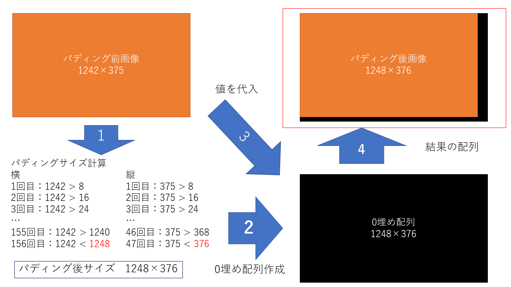

関数名：padding_shape (height, width)

引数：
   * height：画像の縦のサイズ
   * width：画像の横のサイズ
下記の「padding_size」にheight とwidth別々に渡してそれぞれのパディング後のサイズを受け取ります。その値をtuple型にまとめて値を返します。

関数名：padding_size (num)

引数：
   * num：パディング前のサイズ
以下の図は長さを求めるためのイメージ図になります。実際の処理は8を繰り返して足していく方法ではなく、サイズを8で割ることで、何回目に超えるかを求めています。

例：1242の場合

.. math:: 1242 / 8 = 155.25

この場合、155回目までは超えず、156回目で超えることが確認できます。
最終的には以下の式で値を返しています。

.. math:: (155 + 1) * 8 = 1248

実行スクリプト
==================

ここではコンソールコマンドから呼び出される実行スクリプト「tezip.py」について解説します。入力した引数の値をチェックとGPUの有無を確認します。正しくない入力が行われた場合はプログラムを終了するようにしています。引数の意味については「ユーザーズマニュアル」を参照してください。
引数は「argparse.ArgumentParser」を使用して管理しています。引数チェック・GPU確認処理の流れは以下になります。

* 共通

1.	「-f」の値をチェックして、引数で指定されていた場合、「os.environ['CUDA_VISIBLE_DEVICES'] = '-1'」でGPUデバイスの認識を外す。
2.	「tensorflow.python.client device_lib. list_local_devices()」でGPUの有無をチェックする
3.	Falseでフラグを作成して、GPUがあればフラグをTrueにする
4.	フラグがTrueなら「GPU MODE」、Falseなら「CPU MODE」と出力する
5.	学習機構「-l」、圧縮機構「-c」、解凍機構「-u」が複数選択されているかチェックし、複数選択されていたらメッセージを出力してプログラムを終了する
6.	学習機構「-l」、圧縮機構「-c」、解凍機構「-u」のいずれも入力されていない場合はメッセージを出力してプログラムを終了する

* 学習機構

1. 「train mode」と出力
2. 「-l」「-v」の値を渡して学習機構の実行関数を呼び出す

* 圧縮機構

1.	「compress mode」と出力
2.	「-w」と「-t」の値をチェックして入力が無い、もしくは両方に入力があればメッセージを出力してプログラムを終了する

※両方の場合、「SWP」と「DWP」のどちらで実行すればよいのか不明になるため

3.	「-m」の値をチェックして入力が無い、もしくは「abs」「rel」「absrel」「pwrel」以外の値が入力されていた場合、メッセージを出力してプログラムを終了する
4.	「-b」の値をチェックして入力が無い場合、メッセージを出力してプログラムを終了する
5.	「-m」「-b」の値から「absrel」の場合のみ2つ、それ以外は1つになっているかをチェックする。正しくない場合は、メッセージを出力してプログラムを終了する
6.	「-c」「-w」「-t」「-m」「-b」「-v」「-n」の値とGPU認識のフラグを渡して圧縮機構の実行関数を呼び出す

* 解凍機構

1.	「uncompress mode」と出力
2.	「-u」「-v」の値とGPU認識のフラグを渡して解凍機構の実行関数を呼び出す

引数に対して入力する個数が違う場合(-lに1つしか与えないなど)は「argparse.ArgumentParser」が自動で処理するため、基本的にチェックしていません。
圧縮機構で使用する「-b」のみ個数が可変になっているため、⑤のようなチェックを行っています。
「-v」は画面出力のフラグになっています。詳しくはユーザーズマニュアルを参照してください。

学習機構
==================

学習機構については、PredNetの学習プログラムを大きな変更なく使用しています。ファイルは「train.py」になります。
PredNetの学習プログラムは `github上 <https://github.com/coxlab/prednet/blob/master/kitti_train.py>`_ にて公開しております。

学習機構のコントロールフロー
'''''''''''''''''''''''''''''''''''''''''''''''''''''''''''''''

学習機構のフローチャートは以下の図の通りです。

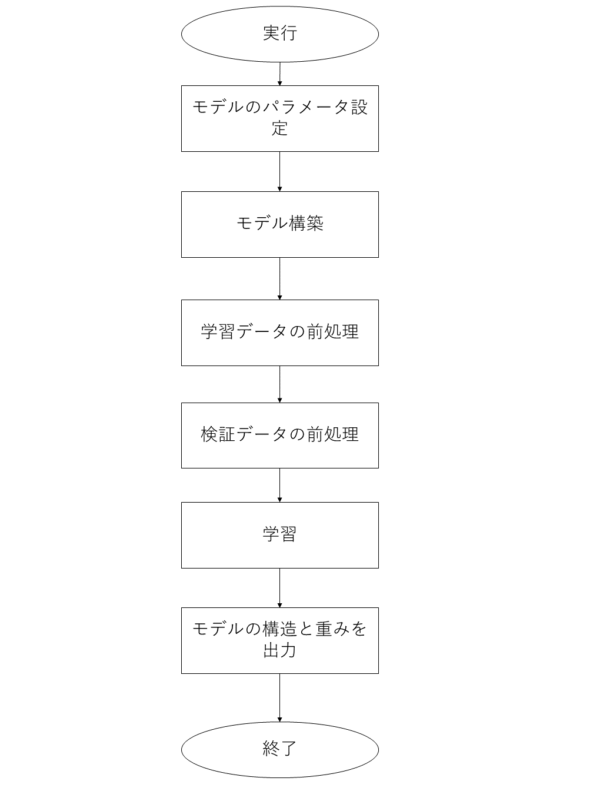

学習機構のフロー解説
'''''''''''''''''''''''''''''''''''''''''''''''''''''''''''''''

モデルパラメータの設定やモデル構築の部分で選択している固定値についてはPredNetの値から変更せずに使用しています。
変更点は入力サイズの指定です。PredNetは学習データ作成プログラムと同じ固定値を選択していましたが、hklファイルからサイズを読み込み、同じ大きさになるように変更しています。
学習パラメータについては変更しています。

* 変更した学習パラメータ

  * nb_epoch：学習のエポック数(100)
  * batch_size：バッチサイズ(1)
  * samples_per_epoch：エポックのシーケンス数(5)
  * N_seq_val：検証画像のシーケンス数(2)
  * nt：1シーケンス内の画像数(2)
  
※シーケンス：連続した画像

これらは固定値として埋め込んでいます。カッコ内の数字が現状の数値になります。現状は最低限の数値で設定しています。これらの数値を大きくすることで、学習精度の向上を見込むことができますが、実行環境のメモリ状況や入力画像サイズによってはデータがメモリに乗りきらず、学習できないことがあります。実行環境によって変更してください。

学習データや検証データの前処理については、PredNetのSequenceGeneratorを使用して、hklファイルの情報を学習に使用できるようにしています。
SequenceGeneratorの変更点としては、画像データを常に保持する仕様だったので、学習データが必要な時にだけデータを読み込むようにしました。これにより、無駄にメモリを使い続ける状態を回避しています。

* SequenceGeneratorの変更点

学習時には「keras.models.model.fit_generator」を使用しているため、nextで次の学習に移行する時の処理を追加することができます。
「self.X」で画像データを保持していたのを、「self.data_file」として、パスだけ保持するようにしました。nextで画像データの取り出しが必要な時は、next内で画像データを読み込むように変更しました。
PredNetのSequenceGeneratorは `github上 <https://github.com/coxlab/prednet/blob/master/data_utils.py#L7>`_ に公開しております。

圧縮機構
==================

圧縮機構では大きく以下の6つの処理に分けられます。ここではこれらの処理で実際に何をしているのかを解説します。ファイルは「compress.py」になります。

1. 推論準備(画像読み込み・モデルセッティング)
2.	推論
3.	Error-bounded quantization
4.	Density-based Spatial Encoding
5.	Entropy Encoding
6.	出力

圧縮機構のコントロールフロー
'''''''''''''''''''''''''''''''''''''''''''''''''''''''''''''''

圧縮機構のフローチャートは以下の図の通りです。

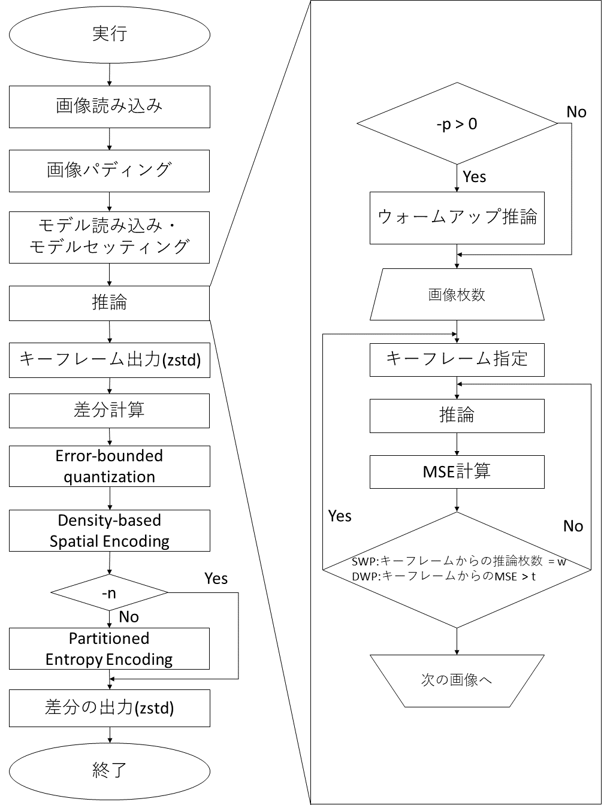

圧縮機構のフロー解説
'''''''''''''''''''''''''''''''''''''''''''''''''''''''''''''''

上記の図である圧縮機構のコントロールフローは左側が圧縮時全体の工程を表しており、右側が推論中の工程を表しています。

推論準備
..........................

圧縮機構のコントロールフローにある「推論」までの前処理の流れを説明します

画像読み込み
..........................

コマンドライン引数で指定したディレクトリにある画像から「Pillow」を使用して画像を読み込みます。読み込んだ際はpython標準の「sorted」に従い、画像をソートします。これにより時系列順に画像が並ぶことを想定しています。
また、PredNetの仕様上、以下のように5次元配列にする必要があります。

(時系列，画像枚数，縦サイズ，横サイズ，チャンネル)

hklにダンプする場合は複数時系列を1つのファイルで管理できます。
今回は1時系列の画像群をフォルダから読み込むため、4次元配列となります。なので、先頭に1時系列であるという情報を追加して5次元配列にしています。

画像パディング
..........................

上記の「パディング」の節にある通り、PredNetの仕様上、画像サイズを「2^(モデルのレイヤ数-1)」の倍数にしなければなりません。そのため、パディングを行って画像サイズを調整します。

画像パディングの実装関数仕様
^^^^^^^^^^^^^^^^^^^^^^^^^^^

以下の関数は「data_utils.py」に実装されています。
関数名：data_padding(X_test)

引数：
   X_test：読み込んだ画像配列
下記の「padding_shape」に画像の縦横のサイズを渡して、パディング後のサイズを取得します。パディング後のサイズで埋めの配列を作成して、その配列に元画像の画像を代入してパディング後の配列とします。

関数名：padding_shape(height, width)

引数：
   * height：画像の縦のサイズ
   * width：画像の横のサイズ
下記の「padding_size」にheight とwidth別々に渡してそれぞれのパディング後のサイズを受け取ります。その値をtuple型にまとめて値を返します。

関数名：padding_size(num)

引数：
   * num：パディング前のサイズ
numのサイズを超えるまでtmp変数に8を足し続けて、numのサイズを超えた場合その値をパディング後のサイズとすることができます。実際の処理は、8を繰り返して足していく方法ではなく、上記の「パディングの実装関数仕様」節のようにサイズを8で割ることで、何回目に超えるかを求めています。
これはPredNetがレイヤ数の関係で8の倍数になればよいため、固定値としています。レイヤ数を変更した場合はこの8という値も変更してください。

モデルセッティング
..........................

「学習機構」で出力されたモデル構造と重みを読み込んでモデルをセッティングします。基本的にはPredNetのモデルセッティングと同じですが、inputの形状を一部変更しています。学習時には1時系列の画像枚数を固定値でセッティングしていましたが、圧縮時には固定できないため、その情報を「None」にして可変にしています。
モデルをセッティングしたら画像サイズとinputのサイズを比較してモデルに対応しているかをチェックします。対応していなかった場合は、その内容を表示してプログラムを終了します。

推論
'''''''''''''''''''''''''''''''''''''''''''''''''''''''''''''''

PredNetのデフォルトの推論では、直前の元画像から次のフレームを推論して、それを繰り返している仕様でした。TEZIP論文では、推論結果画像から推論するという内容であったため、本システムはそのように仕様を変更しました。

ウォームアップ推論
..........................

PredNetはLSTMモデルの一種であるため、前の推論情報を活かして推論します。最初の数フレームを直前の元画像から推論し、ウォームアップとして使用することで、推論の精度が高まる可能性があります。引数「-p」で指定された枚数だけ、直前フレームからの推論を行い、ウォームアップを適用します。
以下の「SWPとDWP」節に出てくるキーフレームの切り替えの基準には含まれないようになっています。

SWPとDWP
..........................

推論結果から次のフレームを推論するということは、段々と精度が落ちていくことになります。精度をある程度保つために、途中で元画像から推論の推論を挟む必要があります。その手法が「Static Window-based Prediction(SWP)」と「Dynamic Window-based Prediction(DWP)」になります。

* SWP
固定値で1枚の画像から推論する枚数を指定します。指定した枚数推論した後、次の推論に必要な元画像をキーフレームとして、その画像から指定した枚数推論します。これを全画像枚数分繰り返します。

* DWP
Mean Square Error(MSE)の閾値を設定して、超えた場合にキーフレームを切り替えます。元画像と推論結果のMean Square Error(MSE)を求め、閾値が超えていなければ続行、超えていた場合はキーフレームを切り替えます。これを全画像分繰り返します。

実行の流れは以下になります。

1.	キーフレームから推論
2.	MSEを計算
3.	基準(SWPなら指定枚数，DWPなら閾値)を超え無かった場合、推論結果から推論
4.	②～③を繰り返す
5.	基準を超えた場合、これまでの値をlistに保存する。その後①～③を繰り返す。
6.	①～⑤を全画素分繰り返す。

以下の図の流れがキーフレーム切り替えの流れになります。実装方法としては、キーフレームを切り替える基準が違うだけで、処理としては同じになるため、一つの条件分岐で切り替えています。
実際にキーフレームとして出力されるのは黄色に当てはまる画像になります。青色の画像は実際には黒(0埋め)として保存され、圧縮したときにほとんど無いものとして扱われます。
また、キーフレームに当てはまる場所の推論画像(灰色の矩形)も、黒(0埋め)として保存されます。

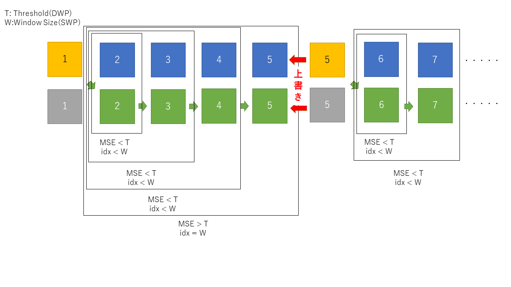

Error-bounded quantization
..........................

ここでは、最終的な画像の圧縮率を上げるため、画像データに非可逆の処理を行います。以下の4つを実装しています。

*	abs
absolute error bound

*	rel
relative bound ratio

*	absrel
「abs」と「relの両方の範囲を満たしている範囲を使用する

*	pwrel
point wise relative error bound

これらは許容範囲を定める手法になります。基準を満たした範囲の値を平均値で統一して量子化します。

画像パディングの実装関数仕様
^^^^^^^^^^^^^^^^^^^^^^^^^^^

関数名：error_bound(origine, diff, mode, value, GPU_FLAG, xp)

引数：
   *	origine：元画像の配列
   *	diff：差分の配列
   *	mode：コマンドライン引数「-m」の文字列
   *	value：コマンドライン引数「-b」の値
   *	GPU_FLAG：GPUを認識しているかのフラグ
   *	xp：「numpy」「cupy」のどちらか(GPUの有無で決まる)

「-m」の文字列を調べ、それぞれに対応した許容範囲を決定します。許容範囲を決定した後は量子化を行います。許容範囲を満たしている値を許容範囲の上限値と下限値の平均値で統一します。
また、valueが0の場合は可逆圧縮の指定として何も処理をせず、diffをそのまま返します。

absolute error bound
^^^^^^^^^^^^^^^^^^^^^^^^^^^

absolute errorは「-b」に入力した値をそのまま使用して許容範囲を決定します。イメージ図が以下の図になります。

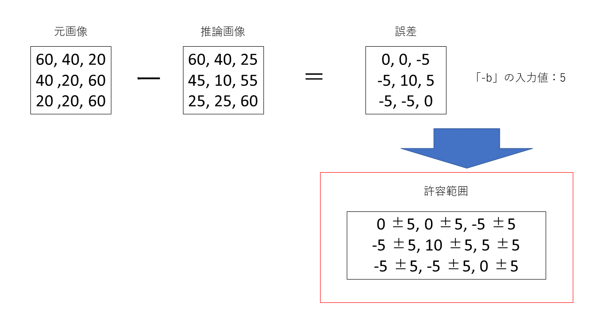

relative bound ratio
^^^^^^^^^^^^^^^^^^^^^^^^^^^

relative bound ratioは誤差の絶対値(絶対誤差)を求めた後、最大値と最小値を求めます。その後最大値から最小値を引いた値に「-b」に入力した倍率をかけた値を許容範囲とします。こちらの内容を式にしたものが以下になります。

.. math::　許容範囲 = (誤差の最大値 – 誤差の最小値) × 倍率

relative bound ratioのイメージ図が以下の図になります。

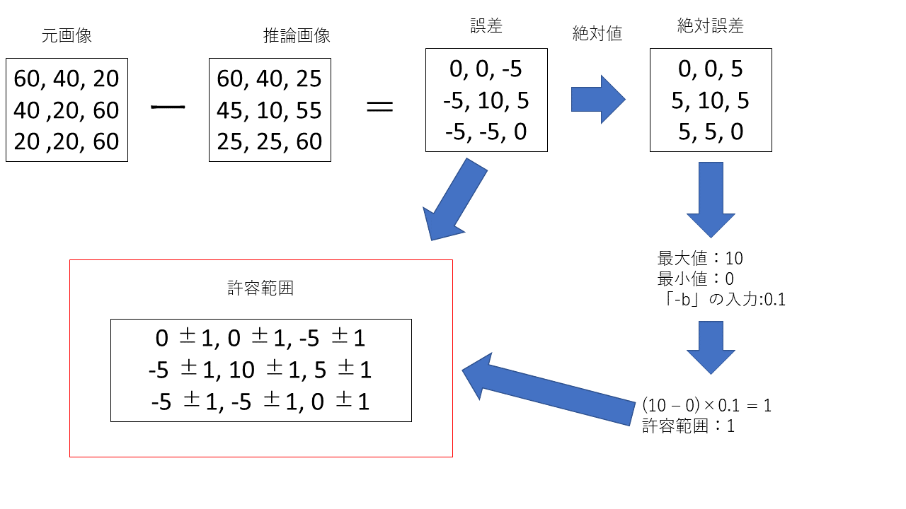

absrel
^^^^^^^^^^^^^^^^^^^^^^^^^^^

上記の「absolute error bound」節で解説したabsと「relative bound ratio」節で解説したrelの両方の範囲を満たしているものを使用します。両方の範囲を満たすということは、値のabsとrelの値を比較して小さい値を使用するということになります。

例は以下の通りです。

+ 配列の値：a
+ absの値：b
+ relの値：c

.. math:: 

   b < c の場合
   ・ 上限値：a + b < a + c　上限値の場合、小さい方が両方の範囲に入るため、a + b
   ・ 下限値：a - b  > a - c　 下限値の場合、大きい方が両方の範囲に入るため、a - b

実際にはフレーム別・チャンネル別にrelの範囲を求めているので、1時系列の中でabsの範囲が使用される場合とrelが使用される場合が頻繁に入れ替わる可能性が高くなります。

absrelのイメージ図が以下の図になります。absとrelの許容範囲を求める部分については「absolute error bound」節と「relative bound ratio」節にあるため、省略しています。

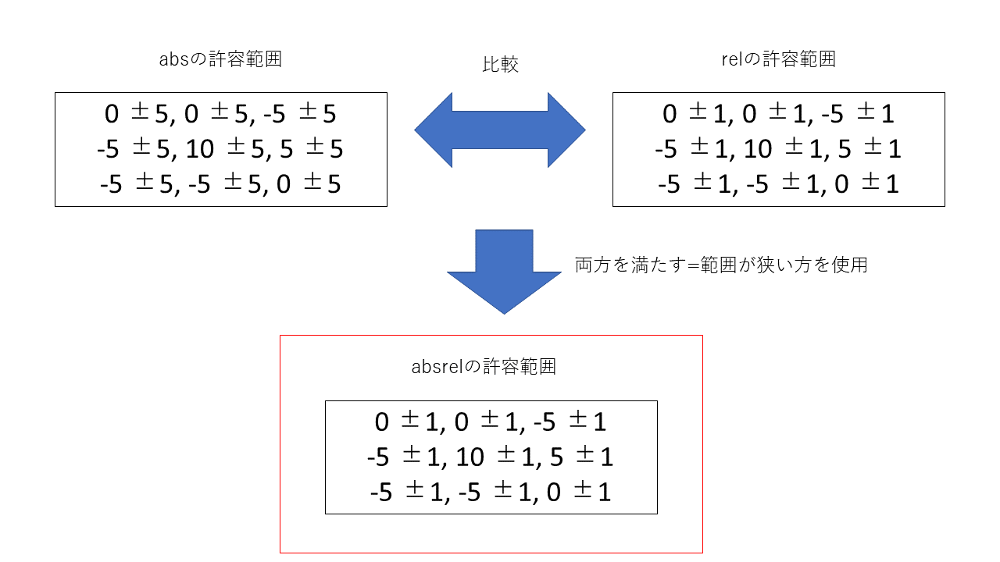

point wise relative error bound
^^^^^^^^^^^^^^^^^^^^^^^^^^^^^^^^^

point wise relative error boundは画素ごとに許容範囲を決定します。「-b」で指定した倍率を元画像に画素ごとにかけて許容範囲を決定します。イメージ図が以下の図になります。

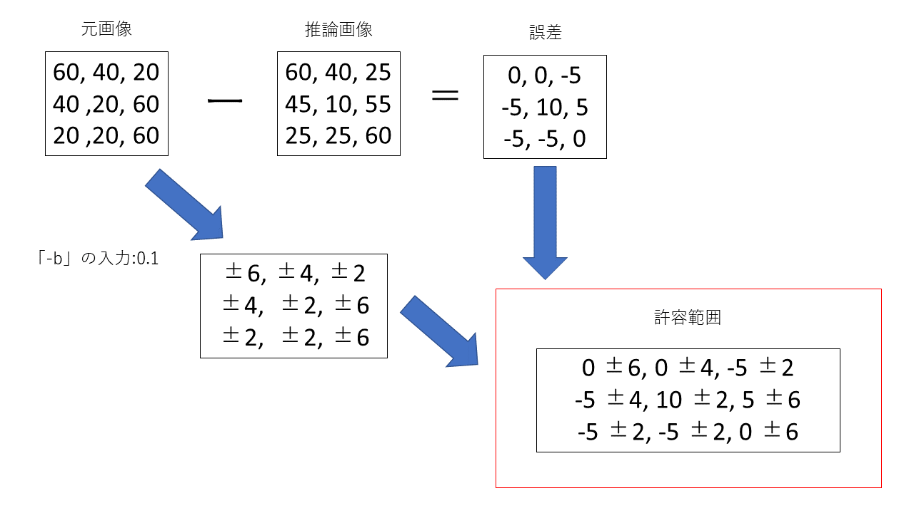

量子化
^^^^^^^^^^^^^^^^^^^^^^^^^^^^^^^^^

量子化は以下の流れで行います。イメージ図が以下の図になります。図では、pwrelで求めた許容範囲を使用しています。

1. 上記の「absolute error bound」から「point wise relative error bound」節のいずれかで求めた許容範囲を使用する
2.	順番に画素の許容範囲を比較していき、重なっている部分の上限値と下限値を採用して更新する
3.	許容範囲に収まらなかった値が来た時、そこまでの値を以下の式で求めた値にする

.. math:: 値 = (上限値 + 下限値) / 2

4.	次の画素の許容範囲を上限値と下限値として使用する
5.	全画素終了まで②～④を繰り返す

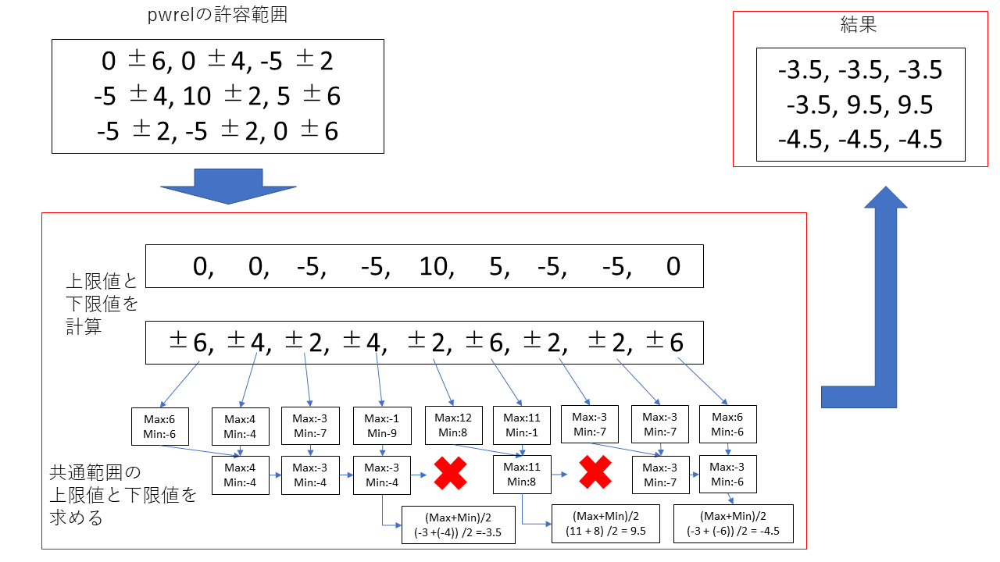

この処理によって、同じ値が連続するように圧縮することができます。これにより今後説明する「Density-based Spatial Encoding」を実行したときに、より圧縮率を高めやすくなります。

Density-based Spatial Encoding
..........................

Density-based Spatial Encodingでは前の画素との差分を求めます。この処理により、画像内で連続している値は全て0となります。これは今後の「Entropy Encoding」の処理をする時の圧縮率を高めることに繋がります。

Density-based Spatial Encodingの実装関数仕様
^^^^^^^^^^^^^^^^^^^^^^^^^^^^^^^^^^^^^^^^^^^^

関数名：finding_difference(arr)

引数：
   * arr：「Error-bounded quantization」の結果配列

実装方法については、最後の値を除いた入力配列から、最初の値を除いた入力配列を引いて計算します。これにより、並列的に計算を行うことができます。一つ一つ値を取り出して計算する方法もありますが、GPUへの最適化として、この方法で実装しています。実装のイメージ図が以下の図になります。図のAとBは以下を表しています。

*	A：最後の値を除いた入力配列
*	B：最初の値を除いた入力配列

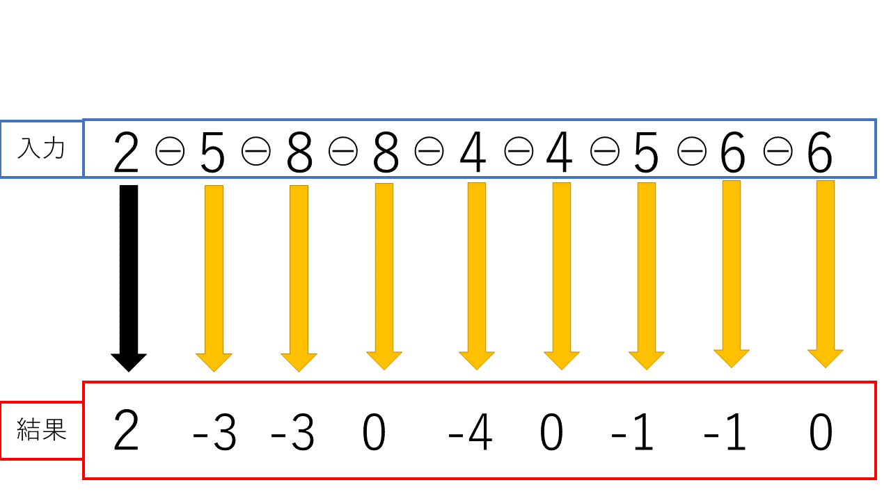

Entropy Encoding
..........................

Entropy Encodingでは頻度の高い値をビット数の小さい値に変換します。これにより、ビット数が小さい値が多くなり圧縮率の向上に繋がります。しかし、値の頻度がまばらになっている場合、圧縮率は高くなりにいという特徴があります。場合によってはEntropy Encodingを行う前よりもサイズが大きくなることもあります。そのため、オプションでEntropy Encodingを実行しないようにすることができます。「-n」が指定された場合はこちらの処理は実行されません。
Entropy Encodingの処理は以下の流れで実装しています。
1.	差分配列を「1600」との差を求めて、その値に変換する。「1600」はマッピングテーブル内の値とマッピングテーブルのインデックスの値が重複しないようにするための数値になります。(後述の「①の処理には2つの目的」のII参照)
2.	頻度の多い値順にソートしたマッピングテーブルを作成する。
3.	マッピングテーブルの中身と一致した差分配列の値をマッピングテーブルのインデックスの値に変換する。

①，②の処理は実行関数内で、③は「replacing_based_on_frequency」関数で実装しています。

①の処理には2つの目的があります。

*	負の数を無くす

マッピングテーブル作成の過程で負の数があるとエラーが起きます。それを防ぐために「1600」から値を引いて、正の数のみに変換します。

*	マッピングテーブル内の値とインデックスの値が重複しないようにする

繰り返し処理でマッピングテーブルと差分配列の比較を順番に行うため、一度変換した値が、後の繰り返し時に、変換の対象になってしまう可能性があります。それを避けるために「1600」との差分に変換します。

* 「1600」との差分前
   * マッピングテーブルの値の範囲：-510～510
   * インデックスの範囲：0～1020

↑上記は0～510が重複している

* 「1600」との差分後
   * マッピングテーブルの値の範囲：1090～2110
   * インデックスの範囲：0～1020

↑重複していない

②，③については実行処理のイメージを以下の図で解説します。入力の値は簡単な例として使用しています。(実際には1090～2110の値が入ります)

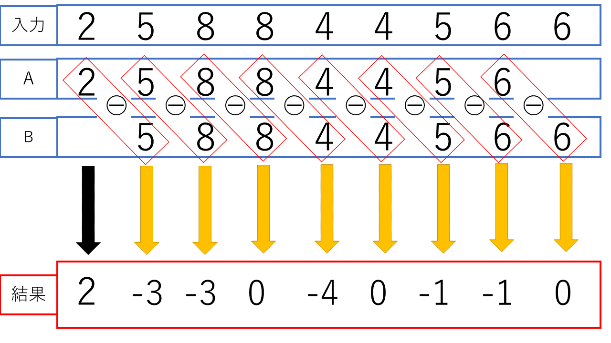

Entropy Encodingの実装関数仕様
^^^^^^^^^^^^^^^^^^^^^^^^^^^^^^^^^^^^^^^^^^^^

関数名：replacing_based_on_frequency(arr, table, xp)

引数：
   *	arr：「Density-based Spatial Encoding」の結果配列
   *	table：マッピングテーブル
   *	xp：「numpy」「cupy」のどちらか(GPUの有無で決まる)

tableは関数に入れる前にlist型からxp配列に変換してから使用します。これは、cupyを使用することになった場合、tableがlist型のままだと、GPUとCPUのデータのやり取りが発生して処理が重くなるためです。
処理の流れについては先ほどの実行処理のイメージ図を参照してください。これを実現するために、xp.whereでマッピングテーブルと配列の値を比較して、一致した場合に配列の値をインデック番号に変換します。

出力
..........................

圧縮機構を実行した後は以下の3ファイルが出力されます。
「.dat」形式のファイルについては出力前に「zstd」ライブラリを使用して圧縮しています。

*	圧縮前の画像名が記録されたテキストファイル(filename.txt)
*	キーフレームファイル（key_frame.dat）
*	実画像と推論結果の差分（entropy.dat）

「filename.txt」は画像を読み込んだ際にパスから画像名をpython標準の「sorted」の順番に抽出して保存しています。解凍時に名ファイル名情報が必要になるためです。
「key_frame.dat」はキーフレームの画像が保存されています。キーフレーム以外の部分については0埋めされており、圧縮時には無視できるサイズになることを想定しています。
「entropy.dat」は先ほどの「推論」の結果から元画像との差分を求めて、「Error-bounded quantization」，「Density-based Spatial Encoding」，「Entropy Encoding」の処理を適用したデータが保存されます。末尾には以下の情報を埋め込んで保存します。これら解凍時に圧縮時の推論を再現するのに必要な情報になります。
*	ウォームアップ推論に使用した枚数
*	キーフレームのshape(画像の枚数, 縦横のサイズ, チャンネル数)
*	「Entropy Encoding」で作成したマッピングテーブル

マッピングテーブルについては、以下の順番で埋め込まれています。

1.	マッピングテーブル
2.	マッピングテーブルの長さ

「-n」でEntropy Encodingを行わない場合もあるため、その場合はマッピングテーブルの長さの部分に「-1」を入れることで、解凍時にEntropy Encodingを行わなかったということが分かるようにしています。

解凍機構
==================

解凍機構では大きく以下の5つの処理に分けられます。ここではこれらの処理で実際に何をしているのかを解説します。ファイルは「decompress.py」になります。

*	推論準備(キーフレーム復元・モデルセッティング・圧縮時の情報取得)
*	圧縮時の推論の再現
*	Entropy Decoding
*	Density-based Spatial Decoding
*	出力

解凍機構のコントロールフロー
'''''''''''''''''''''''''''''''''''''''''''''''''''''''''''''''

解凍機構のフローチャートは以下の図の通りです。

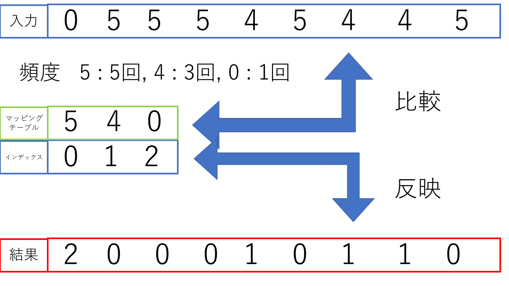

解凍機構のフロー解説
'''''''''''''''''''''''''''''''''''''''''''''''''''''''''''''''

上の図の解凍機構のコントロールフローは左側が解凍時全体の工程を表しており、右側が推論中の工程を表しています。

推論準備
..........................

解凍処理を行う前に、いくつかの前処理を行います。

モデルセッティング
^^^^^^^^^^^^^^^^^^^^^^^^^^^^^^^^^^^^^^^^^^^^

圧縮時のモデルセッティング「モデルセッティング」と同じ方法でモデルをセッティングします。

キーフレーム復元
^^^^^^^^^^^^^^^^^^^^^^^^^^^^^^^^^^^^^^^^^^^^

圧縮時に出力したキーフレームをzstdで復元した後、numpy配列に圧縮時と同じデータ型で変換します。その後、「entropy.dat」に埋め込んでおいたshapeを取り出して変換します。この時、同時に埋め込んでおいた圧縮時のコマンドライン引数「-p」の値も取り出しておきます。
キーフレームでは無い画像は0埋めされているため、「numpy.all」で0以外が含まれているものを抽出して、キーフレームのインデックスを取り出します。

キーフレームパディング
^^^^^^^^^^^^^^^^^^^^^^^^^^^^^^^^^^^^^^^^^^^^

キーフレームに対して「画像パディング」と同じ処理を行い、パディングします。

圧縮時の推論の再現
..........................

以下の流れで圧縮時の推論を再現します。
1. 「キーフレーム復元」で取り出した「-p」の数だけキーフレームから推論
2.	キーフレームから推論
3.	次のキーフレームが来るまで推論結果から推論
4.	次のキーフレームが来たら①に戻る
5.	①～④を繰り返す

④の切り替えは「キーフレーム復元」で取り出した、キーフレームのインデックスを使用して繰り返し実行します。

Entropy Decoding
..........................

ここでは「Density-based Spatial Encoding」の結果を復元します。そのためにentropy.datを読み込んで、差分配列と埋め込んでおいた「Entropy Encoding」で作成したマッピングテーブルを復元します。その後「解凍機構の実装関数仕様」の手順で復元を行います。マッピングテーブルの長さが「-1」だった場合はEntropy Encodingを行っていないことになるため、こちらの処理は実行されません。

Entropy Decodingの実装関数仕様
^^^^^^^^^^^^^^^^^^^^^^^^^^^^^^^^^^^^^^^^^^^^

replacing_based_on_frequency(arr, table, xp)

引数：
   * arr：「Density-based Spatial Encoding」の結果配列
   * table：マッピングテーブル
   * xp：「numpy」「cupy」のどちらか(GPUの有無で決まる)

「Entropy Encoding」では、マッピングテーブルと配列の値を比較して、一致した場合に配列の値をインデック番号に変換しました。これとは逆に、配列の値とマッピングテーブルのインデックスを比較して、一致した場合に配列の値をマッピングテーブルの値に変換します。こちらも「Entropy Encoding」と同様にxp.whereを使用して実装しています。イメージ図が以下の図になります。
また、マッピングテーブル内の値とインデックスの値が重複しないように、「1600」との差分を求めてマッピングテーブル内に保存していたので、関数実行後に「1600」との差分求めて元の値を復元します。

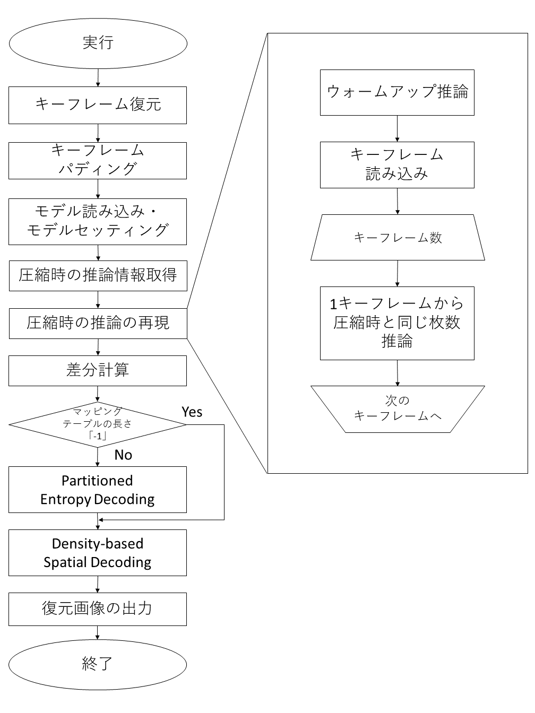

Density-based Spatial Decoding
..........................

ここでは「Error-bounded quantization」の結果を復元します。
「Density-based Spatial Encoding」ではひとつ前の値との差を求めて出力しました。復元する場合、値を一つ一つ参照・計算して、前の結果を使用して復元します。そのため、「Density-based Spatial Encodingの実装関数仕様」節で示した画像のような並列的に処理することは不可能となりました。

実装関数仕様
^^^^^^^^^^^^^^^^^^^^^^^^^^^^^^^^^^^^^^^^^^^^

関数名：finding_difference(arr)

引数：
*	arr：「Entropy Decoding」の結果配列

値を一つ一つ順番に見ていき、次のインデックスの値を引くことで元の値を復元します。実装のイメージ図が以下の図になります。

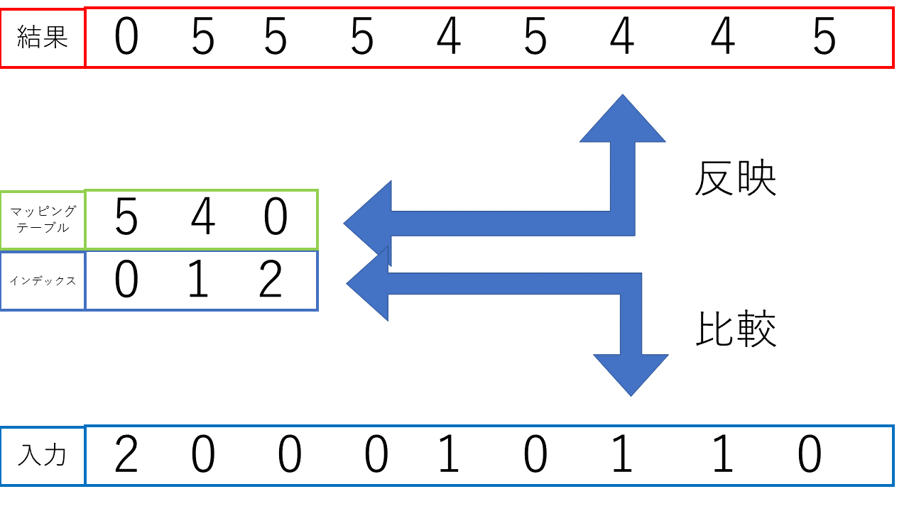

出力
..........................

解凍機構を実行した後は圧縮前の画像ファイルが出力されます。圧縮時に保存しておいた画像名が記録されているfilename.txtに従い名前を付けます。「Pillow」ライブラリを使用して画像を出力します。

GPU(cupy)・CPU(numpy)の使用について
====================================

圧縮・解凍機構の推論後処理については、基本的にはGPUでの処理を想定して並列的に処理するように実装をしました。しかし、中には一つ前の要素の結果を使って計算するものもあり、並列化できないものもありました。そういった処理はGPUで実行した場合遅くなる可能性が高くなるため、CPUで実行しています。以下がその分類になります。

GPU(cupy)で実行する処理
'''''''''''''''''''''''''''''''''''''''''''''''''''''''''''''''

* 「absolute error bound」から「point wise relative error bound」：エラーバウンド機構の許容範囲を求める処理
* Density-based Spatial Encoding
* Entropy Encoding
* Entropy Decoding

CPU(numpy)で実行する処理
'''''''''''''''''''''''''''''''''''''''''''''''''''''''''''''''

* 量子化の処理
* Density-based Spatial Decoding
