Introduction
==============
This document describes the procedures for constructing the environment and operating procedures for the system developed in the "Development of Data Compression Tools for Maintenance and Utilization of Large-scale Research Facilities".

TEZip overview
==============

This system consisits of three mechanisms.

1. Learning mechanism
2. Compression mechanism
3. Decompression mechanism

 

Learning mechanism
'''''''''''''''''''''''''''''

`PredNet <https://coxlab.github.io/prednet/>`_ is used to learn the change in the movement of an object over time.
According to the learning method of PredNet, the learning data is converted into the hkl format and then learned.
The learned model is output to a file. This file is used by the compression mechanism and decompression mechanism.
Use another program to download the training data and convert it to hkl.
The details are explained in section "Learning mechanism" below.
 

Compression mechanism
'''''''''''''''''''''''''''''

Using the model output by the learning mechanism, the results of inference and difference of time series images are compressed.
After deriving the difference between the original image and the inference result,error-bounded quantization, Density-based Spatial Encoding, and Partitioned Entropy Encoding are processed. These processes have the effect of increasing the compression rate when compressing.
Use the zstd library to compress and output to a binary file (.dat).

And,differences and keyframe images are also output to a binary file (.dat) using the zstd library.

 

Decompression mechanism
'''''''''''''''''''''''''''''

Using the model output by the learning mechanism and the binary file (.dat) output by the compression mechanism, the image group input to the compression mechanism is restored.
By inferring by inputting keyframes, the inference result of the compression mechanism is reproduced.
The processing of Density-based Spatial Decoding and Partitioned Entropy Decoding is performed in the reverse order of the compression mechanism, and the original difference is restored.
Since the error-bounded quantization process is lossy compression, it is not included in the decompression mechanism.
The inference result and the difference are added to restore the original image and output it.

Operating environment
========
In this case, we used AWS EC2 to build the machine.

EC2 Information
'''''''''''
* AMI
   CentOS 7.9.2009 x86_64 - ami-00f8e2c955f7ffa9b
* Instance Type
   p2.xlarge
   
Machine Information Overview
''''''''''''''''''''''''''''

* Operating Systems
   CentOS7

* CPU
   Intel(R) Xeon(R) CPU E5-2686 v4 @ 2.30GHz×4 
  
* GPU
   NVIDIA K80(12GB)
   
* Memory
   64GB

Environment construction procedure
============

Follow the steps below to build the environment.

* Install the NVIDIA driver
* Install CUDA
* Install cuDNN
* Create a virtual environment

Install the NVIDIA driver
'''''''''''''''''''''''''''''
Follow the steps below to install the driver so that you can use NVIDIA's GPU.

Disable the standard driver
..........................
You need to turn off the standard driver so that it does not interfere with the installation of the NVIDIA driver. Please execute the following command.

.. code-block:: sh

  lsmod | grep nouveau
  
Then, use a text editor such as vim to create a file in the following directory.

.. code-block:: sh

   /etc/modprobe.d/blacklist-nouveau.conf

Write the following settings in the file you created and save it.

.. code-block:: sh

   blacklist nouveau
   options nouveau modeset=0
   
Then reboot and run the following command. If nothing is displayed, the disabling has been successful.

.. code-block:: sh

   lsmod | grep nouveau
   
Running the installation
..........................
Install the package required to install the NVIDIA driver. Execute the following command.

.. code-block:: sh

   yum -y install kernel-devel kernel-devel-$(uname -r) kernel-header-$(uname -r) gcc gcc-c++ make
  
Then, check the name of your GPU device. You can check it by running the following command.

.. code-block:: sh

   lspci | grep -i nvidia

From the `NVDIA driver download page <https://www.nvidia.co.jp/Download/index.aspx?lang=jp/>`_ as shown in the following figure, select your GPU device and proceed to installation.For **CUDA Toolkit**, please select **10.0**.

.. image:: ./img/img1.png

Next, run the downloaded file to run the NVIDIA driver installer.The following command is an example.Please replace the file name with the one you have downloaded and run it.

.. code-block:: sh

   sh NVIDIA-Linux-x86_64-410.129-diagnostic.run
   
Select "YES" for all of the installer's selections to execute the installation.
The installation is complete when the screen shown in the following figure is displayed.

.. image:: ./img/img2.png

Execute the following command, and if the screen shown in the figure below is displayed, it has been installed correctly.

.. code-block:: sh

   nvidia-smi

.. image:: ./img/img3.png

Install CUDA
'''''''''''''''''''''''''''''

Install CUDA to use the GPU in your programs.
In this case, we will use the CUDA **10.0** version.
Open `the download page <https://developer.nvidia.com/cuda-10.0-download-archive?target_os=Linux&target_arch=x86_64&target_distro=CentOS&target_version=7&target_type=rpmlocal>`_ shown in the figure below and select "Linux", "x86_64", "CentOS", "7", "rpm(local)" or "rpm(network)" to download the installer.

.. image:: ./img/img4.png

Next, run the downloaded file to run the CUDA 10.0 installer. Please run the following command.

.. code-block:: sh

   sudo yum -y install epel-release
   sudo rpm -i cuda-repo-rhel7-10-0-local-10.0.130-410.48-1.0-1.x86_64.rpm
   yum clean all
   yum install cuda

Then, run the following command to pass it through. To reflect the result, please reboot after running it.

.. code-block:: sh

   echo ' PATH=”/usr/local/cuda-10.0/bin${PATH:+:${PATH}}"' >> ~/.bashrc
   echo 'export LD_LIBRARY_PATH=”/usr/local/cuda-10.0/lib64${LD_LIBRARY_PATH:+:${LD_LIBRARY_PATH}}"' >> ~/.bashrc

After rebooting, please execute the following command. If the screen shown in the figure below appears, the software has been installed correctly.

.. code-block:: sh

   nvcc -V

.. image:: ./img/img5.png

Install cuDNN
'''''''''''''''''''''''''''''

Following CUDA, we will download cuDNN to use GPU in our programs.
You will need to create an NVIDIA account in advance. You may be asked to log in during the following procedure, so if you haven't created one, please do so at that time.
This time, we will use cuDNN **7.6.5** version.
Go to `the download page <https://developer.nvidia.com/rdp/cudnn-archive>`_ shown in the figure below and select "Download cuDNN v7.6.5 (November 5th, 2019), for CUDA 10.0" and "cuDNN Library for Linux" to download.

.. image:: ./img/img6.png

After the download is complete, unzip the file and place it in an appropriate location. Execute the following command.

.. code-block:: sh

   tar zxf cudnn-10.0-linux-x64-v7.6.5.32.tgz
   sudo cp -a cuda/include/* /usr/local/cuda/include/
   sudo cp -a cuda/lib64/* /usr/local/cuda/lib64/
   sudo ldconfig

Create a virtual environment
'''''''''''''''''''''''''''''

To separate the Python environment and make it easier to manage, we will use a virtual environment.
In this case, we will use "pyenv". We will install and use "anaconda" in it.

Install pyenv
..........................

Install pyenv and enable the "pyenv" command. Execute the following command and then reboot.

.. code-block:: sh

   git clone https://github.com/yyuu/pyenv.git ~/.pyenv
   echo 'export PYENV_ROOT="$HOME/.pyenv"' >> ~/.bashrc
   echo 'export PATH="$PYENV_ROOT/bin:$PATH"' >> ~/.bashrc

If you are using pyenv, use pip to install the library. This may involve unzipping the zip file, so if you do not have the zip command, you will need to install it. You can install it by running the following command

.. code-block:: sh

   yum -y install zip unzip bzip2
   
Install anaconda
..........................

Install anaconda in pyenv to create a virtual environment. You can run the command "pyenv install -l" to see a list of environments that can be installed. This time, we will use "anaconda3-4.3.1". The command to create a virtual environment is as shown below.

.. code-block:: sh

   eval "$(pyenv init -)"
   pyenv install anaconda3-4.3.1

After that, you can enter the virtual environment by executing the following command.

.. code-block:: sh

   pyenv rehash
   pyenv global anaconda3-4.3.1

Run the following command to check the version, and if you see the following message, you have entered the virtual environment.

.. code-block:: sh

   python -V
   Python 3.6.0 :: Anaconda 4.3.1 (64-bit)

Install the required libraries
..........................

After entering the environment with anaconda in pyenv, we will use pip to install the necessary libraries. First, update pip with the following command.

.. code-block:: sh

   pip install --upgrade pip
   
Next, run the following command to install the necessary libraries.

.. code-block:: sh

   pip install tensorflow-gpu==1.15
   pip install keras==2.2.4
   pip install hickle==4.0.1
   pip install numba==0.52.0
   pip install zstd==1.4.5.1
   pip install Pillow==8.0.1
   pip install scipy==1.2.0
   pip install h5py==2.10.0
   pip install cupy-cuda100==8.4.0
   pip install numpy==1.19.5

If you want to run the sample program for creating training data using Kitti data in the appendix, please install the following libraries additionally.

.. code-block:: sh

   pip install requests==2.25.1
   pip install bs4
   pip install imageio==2.9.0

If you run the following command and see "GPU" in the device_type field in the figure below, your Python program has successfully recognized the GPU.

.. code-block:: sh

   python
   # python interactive mode below
   >>> from tensorflow.python.client import device_lib
   >>> device_lib.list_local_devices()

.. image:: ./img/img7.png

How to solve problems that occur during environment building
'''''''''''''''''''''''''''''

Depending on the environment you are using, the previous steps may not work in some cases.
In this section, we will describe the problems we encountered while building the test environment and the solutions. If you encounter the same problem, please refer to this section.

When you run "pip install", you get an error and cannot install.
..........................

Depending on your permissions at runtime, you may get an error when you try to "pip install". This error occurs because you do not have permission to uninstall the previous version.
In this case, you can use the option "--ignore-installed" to ignore the dependency with the already installed library and install it.
An example of the command is shown below.

.. code-block:: sh

 pip install tensorflow-gpu==1.15 --ignore-installed

Cannot output files due to lack of file write permission
..........................

Depending on your permissions at runtime, you may not be able to output files from python in the virtual environment. In this case, you can run "sudo python" with administrator privileges to invoke python if it is installed outside the virtual environment.
In order to invoke python in the virtual environment from "sudo python", the following steps are required.

1. Open "/etc/sudoers" with a text editor such as vim.
2.  Add "[pyenv save location]/.pyenv" and "[pyenv save location]/.pyenv/bin" to "Default secure_path".
3.  If you are using vim, use ":wq!" to force a save, as you may get a warning and be unable to save.
4. Restart the system.

As an example of step 2, if you saved pyenv to "/home/pi", change as follows

.. code-block:: sh

 # Before change
 Default secure_path="/usr/local/sbin:/usr/local/bin:/usr/sbin:/usr/bin:/sbin:/bin"

 # After change
 Default secure_path="/home/pi/.pyenv/shims:/home/pi/.pyenv/bin:/usr/local/sbin:/usr/local/bin:/usr/sbin:/usr/bin:/sbin:/bin"

The GPU is recognized in Python interactive mode, but not when run in the console
..............................................................................

When running in python interactive mode, the GPU is recognized as shown in the following figure, but when executing the commands described in the next section, "Command Execution Examples and Arguments", it may be in "CPU MODE".
In this case, the NVIDIA driver may have been installed with wrong settings.
Please uninstall the NVIDIA driver and reinstall it again.
The command to uninstall the NVIDIA driver is as follows.

After executing the command, the GUI screen will appear as it did during installation, so follow the instructions to uninstall the software.
When installing again, use the installer downloaded in the section "Executing the Installation".

Operation Method
==================

In this system, "tzip.py" is the main executable program.
It switches between learning, compression, and decompression mechanisms by using different arguments.
When executing the various mechanisms, "GPU MODE" will be displayed if the GPU is correctly recognized, and "CPU MODE" will be displayed if the GPU is not recognized, automatically switching between GPU and CPU usage.
To avoid situations where programs cannot run due to the size of the GPU memory, there is also an option to force CPU mode without using the GPU.For details, please refer to the arguments of each mechanism.
In addition to "tzip.py", there is another program called "train_data_create.py" to create the training data. This should be written as well.
(There is also a sample program for creating training data using Kitti data in the appendix.If you are unable to prepare training data, please use this program).

Supported image formats
'''''''''''''''''''''''''''''

This system uses "Pillow" for loading images, which supports the following image formats (some excerpts).

* bmp
* jpg
* jpg 2000
* png
* ppm

For more information about all the formats supported by Pillow, please refer to `the Pillow documentation page  <https://pillow.readthedocs.io/en/stable/handbook/image-file-formats.html>`_

Supported image modes
''''''''''''''''''''''''''''''

Supported image modes differ between the learning mechanism and the compression/decompression mechanism, and are as follows.

**learning mechanism**

* All formats supported by Pillow (details can be found on the `Pillow documentation page <https://pillow.readthedocs.io/en/stable/handbook/concepts.html>`_)

**compression/decompression mechanism**

* RGB
* Gray Scale

As a point of caution, it is internally processed as an image in RGB mode. In other words, the learning mechanism first converts the image to RGB mode. The compression/decompression mechanism converts to RGB mode before compression and restores the original image mode after decompression.

Learning data creation program
''''''''''''''''''''''''''''''''

The training data creation program is "train_data_create.py".
Based on PredNet's training data creation program, it converts the images for training into hkl format and dumps them into a single file.

Folder Architecture
..........................

The architecture of a folder of training images should be constructed as follows.
The folders in the hierarchy enclosed by **<>** represent the time series.
The image files enclosed by **""** are the bottom level image files.
It is recommended that the image file names be numbered in chronological order so that they can be sorted and loaded in order.
When doing so, please adjust the number of digits by adding 0 at the beginning so that they are consistent.

Example: 100 images with the name "image_***.png".
"image_0000.png", "image_0001.png", "image_0002.png"... "image_0098.png", "image_0099.png", "image_0100.png
Note that if the number of digits is not unified, "10" will be loaded after "1" due to the sort order problem in python.

.. code-block:: sh
   
   The folder of input images specified by the argument
   ├─<sequence_1 >
   │     ├─"image_0000.png"
   │     ├─"image_0001.png"
   │      …
   ├─<sequence_2 >
   │     ├─"image_0000.png"
   │     ├─"image_0001.png"
   │     …
   ├─<sequence_3 >
   │     ├─"image_0000.png"
   │     ├─"image_0001.png"
   │     …
    ….
   
Running the program
..........................
 
The flow to run the training data creation program is as follows.

1. Enter the virtual environment that you created in the section "Creating a Virtual Environment".
2. Enter the src directory of this system
3. Run the Python command "train_data_create.py". (For examples and arguments, see the section below on "Command Examples and Arguments")

Example of command execution and arguments
^^^^^^^^^^^^^^^^^^^^^^^^^^^^^^^^^^^^^^^^^^^^^^^^^^^^^^^^^^^^^^^

Execute the following command

.. code-block:: sh
   
  python train_data_create.py Learning_image_directory Output_directory
 
The meaning of each argument is as follows

.. csv-table::
   :header: "Argument", "Meaning", "Configuration example"
   :widths: 10, 25, 15
   
   "First parameter", The directory path containing the training images to be dumped into the Hkl file. ,"./data"
   "Second parameter", Directory path to output Hkl file. ,"./data_hkl"
   "-v", "| Specifies the path of the directory used for verification among the directories specified in the first argument.Without this option, randomly determined. ", "-v ./data/sequence_1"
   
As an execution example, the following command is used to dump to hkl.

.. code-block:: sh
   
  python train_data_create.py ./data ./data_hkl
 
Output file
..........................

The following files will be output to the specified destination directory.

* X_train.hkl
* X_val.hkl
* sources_train.hkl
* sources_val.hkl

"X_***.hkl" is the dumped image data, and "sources_***.hkl" is the saved architecture information of the directory.
Note that the file names are fixed values and are referred to by the learning mechanism, so please do not change them.

Learning mechanism
'''''''''''''''''''''''''''''

The flow to run the learning mechanism is as follows.

1. Enter the virtual environment that you created in the "Create Virtual Environment" section
2. Enter the src directory of the system
3. Run the Python command tzip.py with "-l". (See future sections for examples and arguments)

Input file
..........................

* Learning image data(X_train.hkl)
* Validation image data during training(X_val.hkl)
* Architecture information of the training image directory(sources_train.hkl)
* Architecture information of the directory of validation images during training(sources_val.hkl)

Example of command execution and arguments
....................................................

Execute the following command.

.. code-block:: sh
   
   python tezip.py -l Output_directory Directory_for_training_data

The meaning of each argument is as follows.

.. csv-table:: 
    :header: Argument name, Argument Meaning, Number of inputs, Input Meaning, Example
    :widths: 10, 15, 10, 25, 15
    
    -l,Execute learning mechanism,2,"| 1：The path to the output directory of the model
    | 2：Path of the training data directory(.hkl)","| ./model
    | ./tarin_data"
    -f,Forced CPU mode flag,0,"「-f」to the runtime will disable the GPU and force it to run on the CPU","-f"
    -v,Flag for screen output,0,"「-v」to the runtime, the learning status, such as losses and epochs during learning, will be output to the console.","-v"

An example is shown below.

.. code-block:: sh
   
  python tezip.py -l ./model ./tarin_data

Output file
..........................

The following files will be output to the specified destination directory.

* Model structure file（prednet_model.json）
* Weighted file（prednet_weights.hdf5）

Compression mechanism
'''''''''''''''''''''''''''''

To operate the compression mechanism, perform the following steps.

1.  Enter the virtual environment that you created in the "Create Virtual Environment" section
2.  Go to the src directory of this system
3. Run the Python program "tzip.py" using the Python command with "-c". (See below for examples and arguments)

Input file
..........................

This program requires the following files, which are output by the learning mechanism.

* Model structure file output by the learning mechanism（prednet_model.json）
* Weight file of the trained model output by the learning mechanism (prednet_weights.hdf5)
* Image files to be compressed

In order to sort and load the files in order, it is recommended that the names of the image files to be compressed be numbered in chronological order.
Also, when doing so, please adjust the number of digits by adding a zero at the beginning so that the number of digits is consistent.

Example:100 images under the name of 「image_***.jpg」

「image_0000.jpg」「image_0001.jpg」「image_0002.jpg」…「image_0098.jpg」「image_0099.jpg」「image_0100.jpg」

Note that if the number of digits is not consistent, "10" will be loaded after "1" due to the sort order problem in python.

Example of command execution and arguments
..............................................................................

.. code-block:: sh
   
  python tezip.py -c  Model_directory Directory_of_images_to_be_compressed Output_directory -p Number_of_warm-up_sheets -w or -t [-w Number_of_inferences_to_be_made_from_a_single_keyframe , -t MSE_threshold_for_keyframe_switching] -m Error-bound_mechanism_name -b Threshold_for_error_bouncing_mechanism

The meaning of each argument is shown in the table below.

.. csv-table:: 
    :header: Argument name, Argument Meaning, Number of inputs, Input Meaning, Example
    :widths: 10, 15, 10, 25, 15
    
    -c,Run the compression mechanism,3,"| 1：Path of the directory of trained models
    | 2：Directory path of the image to be compressed
    | 3：Output directory path for compressed data","| ./model
    | ./image_data
    | ./comp_data"
    -w,Specifying the keyframe switching criteria,1,"| SWP(Static Window-based Prediction)to specify how many keyframes to infer from one keyframe of execution
    | If it is specified at the same time as -t 、 it will cause an error termination","-w 5"
    -t,Specify the criteria for keyframe switching,1,"| Specify the threshold value of MSE(Mean Square Error) for execution switching in DWP(Dynamic Window-based Prediction)
    | If it is specified at the same time as -w、 it will cause an error termination","-t 0.02"
    -p,Number of images for warm-up,1,The more keyframes you specify for LSTM recording、 the larger the "key_frame.dat" will be and the smaller the "entropy.dat" will likely be.However、 if you set the number of keyframes to 0 or 1 when running DWP、 the MSE will become larger and the final number of keyframes may become larger,3
    -m,Selecting an error-bound mechanism,1,"| Select the error bouncing mechanism from the following four types
    | abs：absolute error bound
    | rel：relative bound ratio
    | absrel：Do both of the above
    | pwrel：point wise relative error bound
    | If you select multiple items or select non-existent items、 the program will exit with an error","| abs
    | rel
    | absrel
    | pwrel"
    -b,Threshold for error bouncing mechanism,"| When「-m」is absrel：2
    | In other cases：1","| Specify the tolerance threshold of the error bouncing mechanism.If 「-m」 is specified as absrel、 enter two values
    | First：Abs threshold
    | Second：Rel threshold
    |  If an inappropriate number of inputs are given for the one specified by 「-m」、the program will exit with an error.If the input contains 「0」、the error bouncing mechanism will not be executed and the data will be fully lossy compressed.","| -m abs -b 5
    | -m rel -b 0.1
    | -m absrel -b 5 0.1
    | -m pwrel -b 0.1"
    -f,Forced CPU mode flag,0,By adding 「-f」 to the runtime、 you can disable the GPU and force it to run on the CPU,-f
    -v,Flag for screen output,0,When 「-v」 is added at runtime、 the status during execution、 such as the value of MSE after inference and the time taken for the compression process、 will be output to the console,-v
    -n,Flag to disable Entropy Coding for compression process,0,By adding 「-n」 at runtime、 you can output without Entropy Coding、 which is performed as a compression process、 because Entropy Coding does not work effectively in some cases and may cause the image size to increase,-n

An example of execution is shown in the following command

.. code-block:: sh
   
  python tezip.py -c ./model ./image_data ./comp_data -p 3 -w 5 -m pwrel -b 0.1

Output file
..........................

The following files will be output to the specified destination directory.

* Keyframe file (key_frame.dat)
* Difference between the real image and the inferred result (entropy.dat)
* A text file (filename.txt) in which the name of the image before compression is recorded.

Do not change the file name, as it will be referenced by the decompression mechanism with a fixed value.

Decompression mechanism
'''''''''''''''''''''''''''''''''''''''''''''''''''''''''''''''''''''''''''''''''''''''

The flow to run the decompression mechanism is as follows.

1. Enter the virtual environment that you created in the "Create Virtual Environment" section
2. Enter the src directory of this system
3. Run the Python program tzip.py using the Python command with 「-u」 (See the section below for execution examples and arguments)

Input file
..........................

This program requires the following files output by the learning and compression mechanisms.

* Output from the learning mechanism
   
  * Model structure file (prednet_model.json)
  * Trained model weights file (prednet_weights.hdf5)

* Output of the compression mechanism

  * Keyframe file (key_frame.dat)
  * Difference between real image and inference result (entropy.dat)
  * Text file containing the name of the image before compression (filename.txt)

Example of command execution and arguments
..............................................................................

Please execute the following command.

.. code-block:: sh
   
  python tezip.py -u Model_directory Directory_of_compressed_data Output_directory

The meaning of each argument is shown in the table below.

.. csv-table::
    :header:  Argument name, Argument Meaning, Number of inputs, Input Meaning, Example
    :widths: 10, 15, 10, 25, 15
   
    -u,Run the learning mechanism,3,"| 1：Directory path of trained models
    | 2：Directory path for compressed data (.dat), etc.
    | 3：Output directory path for unzipped data","| ./model
    | ./comp_data
    | ./uncomp_data"
    -f,Forced CPU mode flag,0,"By adding 「-f」 to the runtime, you can disable the GPU and force it to run on the CPU.","-f"
    -v,Flag for screen output,0,"By adding 「-v」 at runtime, the processing time during decompression is output to the console","-v"

An example of how to do this is shown below.

.. code-block:: sh
   
  python tezip.py -u ./model ./comp_data ./uncomp_data

Output file
..........................

The following files will be output to the specified destination directory

* Compressed images: Group of files

Appendix
=============

A sample program for creating training data using Kitti data
'''''''''''''''''''''''''''''''''''''''''''''''''''''''''''''''''''''''''''''''''''''''''''''''''''''''''''''''''''''''''''''''''''''''''''''''''''''''''''''''''''''''''''''''''''''''''''''

The sample program for creating training data is "kitti_train_data_create.py".
Based on PredNet's training data creation program, it dumps a large number of images from the kitti data set into a single file in hkl format for training.

System Overview
....................................

The learning data creation program consists of the following three blocks

* Login to the kitti site
* Downloading and decompression of image data
* Dumping the data (converted to hkl files)

Downloading the kitti dataset requires registration on the `kitti site <https://www.cvlibs.net/datasets/kitti/user_register.php>`_. Please register as a user in advance.
When running the program, you need to specify the email address and password you used when registering.

Downloading the data requires about 200GB of space. The breakdown is 165 GB for the zip file immediately after downloading, and 30 GB after unzipping.
Dumping the data requires 42128 images of size 1248×376 to be stored in memory if the data is run as it is after downloading. Depending on the environment, the following error may occur due to insufficient memory.
In this case, please reduce the number of images before executing the program.

.. code-block:: sh
   
  numpy.core._exceptions.MemoryError: Unable to allocate 55.2 GiB for an array with shape (42128, 376, 1248, 3) and data type uint8

Folder Architecture
....................................................

The architecture of the downloaded kitti data looks like the following.
The folders in the hierarchy surrounded by <> represent a single time series.
The "city", "residential" and "road" are the categories of the kitti data. There is no particular impact on the use of this data in PredNet.
If you want to reduce the data, please delete it from the folder surrounded by <>.
However, please do not delete "city/2011_09_26_drive_0005_sync" as it is assigned to the validation data being trained.
When replacing the data, replace only the bottom layer of image files enclosed in "", and leave the folder structure as it is.
If you want to add new data, please create a similar hierarchical structure of folders and add them from the red.

.. code-block:: sh
   
   raw
   ├─city
   │    ├─<2011_09_26_drive_0001_sync>
   │    │    └─2011_09_26
   │    │         └─2011_09_26_drive_0001_sync
   │    │              └─image_03
   │    │                   └─data
   │    │                        ├─"0000000000.png"
   │    │                        ├─"0000000001.png"
   │    │                         …
   │    ├─<2011_09_26_drive_0002_sync>
   │     …
   ├─residential
   │    ├─<2011_09_26_drive_0001_sync>
   │     …
   └─road
      ├─<2011_09_26_drive_00015_sync>
          …

Execute the program
..........................

The flow of executing the learning data creation program is as follows.

1. Enter the virtual environment that you created in the "Create Virtual Environment" section
2. Enter the src directory of this system
3. Use the Python command to run the Python program kitti_train_data_create.py. (For execution examples and arguments, see the "Command execution examples and arguments" section below)

Example of command execution and arguments
^^^^^^^^^^^^^^^^^^^^^^^^^^^^^^^^^^^^^^^^^^^^^^^^

Execute the following command.

.. code-block:: sh

   python kitti_train_data_create.py Output directory -d <e-mail address> <password> -p

The meaning of each argument is shown in the table below.

.. csv-table::
   :header: Argument name, Argument Meaning,Number of inputs, Input Meaning, example
   :widths: 10, 15, 10, 25, 15
   
   First quotation,Directory path to output Hkl file, \-, \-, ./data
   -d,Flag to download the Kitti data set, 2, "| 1：Email address registered on the kitti site
   | 2：password registered on the kitti site", -d tezip@tezip.com nfoe2fjep233af
   -p,Flag for processing a group of image data to change to hkl.The output directory of -d and the input/output directory of -p are common,0, \-,-p

As an execution example, if you want to download the data and dump it directly to hkl, you can use the following command.

.. code-block:: sh

   python kitti_train_data_create.py ./data -d tezip@tezip.com nfoe2fjep233af -p

Output file
..........................

The following files will be output to the specified destination directory.

* Download and extract the image data
 
  * raw.zip
  * raw directory (see section "Folder Architecture" for an overview of the contents)

* Dump the data (converted to hkl files)
 
  * X_train.hkl
  * X_val.hkl
  * sources_train.hkl
  * sources_val.hkl

"X_***.hkl" is a dump file of image data, and "sources_***.hkl" is a file of directory architecture information.
Please do not change the file name, as it will be referred to by the learning mechanism with a fixed value.

Detailed system description
============================

The descriptions that follow describe the information needed to add extensions to this system. As a prerequisite, it is assumed that the reader also has an overview of `PredNet <https://coxlab.github.io/prednet/>`_ , a model for predicting future frames.

How the program works to create training data
===============================================

The training data creation program is basically based on PredNet's training data creation program. The following changes and additions have been made from the original program.

* Change the input folder configuration to your own configuration
* Added automatic separation of input data for training and evaluation
* Changed the process of cropping images to a certain size to padding to the range of possible PredNet input

PredNet training data creation programs are available on  `github <https://github.com/coxlab/prednet/blob/master/process_kitti.py>`_ .

Control flow of the training data creation program
'''''''''''''''''''''''''''''''''''''''''''''''''''''''''''''''

The flowchart of the training data creation program is shown in the figure below.

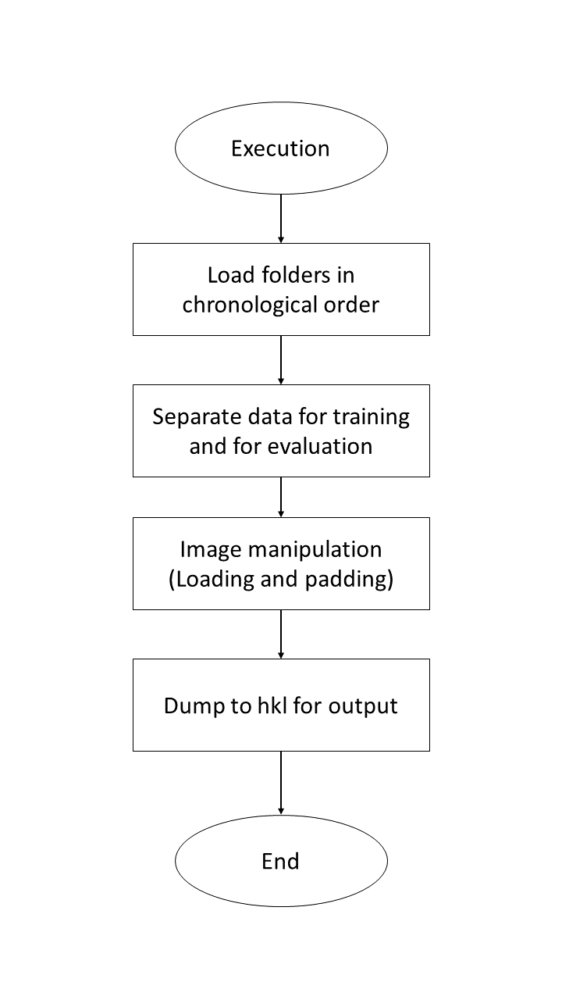

Explanation of the flow of the training data creation program
'''''''''''''''''''''''''''''''''''''''''''''''''''''''''''''''

The following is a block-by-block explanation of the flow of the training data creation program.

Program execution
..........................

Preparing data for evaluation when learning makes it easier to learn correctly. For this reason, we try to use a portion of the input folder for evaluation.
As an ideal ratio, we aim for 9:1 for learning and evaluation. However, we try to use at least one folder for validation. The implementation flow is as follows.

1. Load a folder (1 time series) and save it to list
2. Determine the number of folders for evaluation by finding the number of list and dividing by 10
3. If ② is less than 1, set to 1
4. Extract a random number from the list of folders until the number obtained in ② and ③ is reached
5. Those extracted in ④ are used for evaluation and the remaining ones are used for learning

Padding
..........................

The reason for padding is a matter of PredNet specifications.
PredNet requires the image size to be a multiple of "2^(number of layers in the model - 1)" Since the default number of layers in PredNet is 4, we use a fixed value to padding to a multiple of 8.If you change the model structure of PredNet, please change this value as well.

Example: Actual value　
Number of layers: 4

Image size in this example must be a multiple of 8

.. math:: 2^(4-1) = 8	

Padding Implementation Function Specification
^^^^^^^^^^^^^^^^^^^^^^^^^^^^^^^^^^^^^^^^^^^^^^^^^^^^^^^^^^^^^^^

Within the execution function, pass the image height and width to "padding_shape" below to obtain the size after padding. Create a 0-filled array with the size after padding, and assign the original image to the array to make it the array after padding. The image diagram is shown below. The values of the original image are assigned starting with index number 0. As a result, the padded area comes in the lower right corner.

.. image:: ./img/img25.png

Function name:padding_shape (height, width)

Argument:
   * height：Vertical size of the image
   * width：Horizontal size of the image

Pass height and width separately to "padding_size" below to receive the size of each after padding. The values are combined into a tuple type and the value is returned.

Function name:padding_size (num)

Argument:
   * num：Size before padding

The following diagram shows an image for determining the length. The actual process is not a method of repeatedly adding 8, but rather dividing the size by 8 to find the number of times it is exceeded.

Example: In the case of 1242

.. math:: 1242 / 8 = 155.25

In this case, we can confirm that it is not exceeded until the 155th time, but is exceeded at the 156th time.
The final value is returned by the following equation.

.. math:: (155 + 1) * 8 = 1248

Executable script
==================

This section describes the executable script "tezip.py" that is called from the console command. It checks the value of the input arguments and the presence or absence of a GPU. If incorrect input is made, the program is terminated. See the User's Manual section for the meaning of the arguments.
Arguments are managed using "argparse.ArgumentParser".The flow of the argument check and GPU confirmation process is as follows.

* Common

1. Check the value of "-f" and derecognize the GPU device with "os.environ['CUDA_VISIBLE_DEVICES'] = '-1'" if it is specified as an argument
2. Check for GPU availability with "tensorflow.python.client device_lib. list_local_devices()"
3. Create a flag with False and set the flag to True if there is a GPU
4. Outputs "GPU MODE" if the flag is True and "CPU MODE" if the flag is False
5. Checks whether the learning mechanism "-l", the compression mechanism "-c", and the decompression mechanism "-u" are selected more than once, and if more than one is selected, outputs a message and terminates the program
6. If neither the learning mechanism "-l", the compression mechanism "-c", nor the decompression mechanism "-u" is entered, a message is output and the program terminates

* Learning mechanism

1. Output "train mode"
2. Call the execution function of the learning mechanism by passing the "-l" and "-v" values

* Compression mechanism

1. Output "compress mode"
2. Call the decompression mechanism execution function by passing the "-w" and "-v" values and the GPU recognition flag

※Because in the case of both, it will be unclear whether it should be performed by "SWP" or "DWP"

3. Check the value of "-m" and if there is no input or a value other than "abs", "rel", "absrel", or "pwrel" is entered, output a message and exit the program
4. Check the value of "-b" and if there is no input, output a message and terminate the program
5. Check if the values of "-m" and "-b" indicate two only for "absrel" and one for all other cases. If incorrect, output a message and terminate the program
6. assing the values of "-c", "-w", "-t", "-m", "-b", "-v", and "-n" and the GPU-recognized flags, and calling the compression mechanism execution function

* Decompression mechanism

1. Output "uncompress mode"
2. Call the decompression mechanism execution function by passing the "-u" and "-v" values and the GPU recognition flag

If the number of pieces entered for an argument is different (e.g., only one piece is given for -l), "argparse.ArgumentParser" handles it automatically, so it is basically not checked.
Only "-b" used in the compression mechanism is checked as shown in ⑤ because the number of "-b" is variable.
v" is a flag for screen output. Please refer to the user's manual for details.

Learning mechanism
====================================

For the learning mechanism, the PredNet learning program is used without major changes. The file is "train.py".
The PredNet training program is available on `github <https://github.com/coxlab/prednet/blob/master/kitti_train.py>`_ .

Control flow of the learning mechanism
'''''''''''''''''''''''''''''''''''''''''''''''''''''''''''''''

The flowchart of the learning mechanism is shown in the figure below.

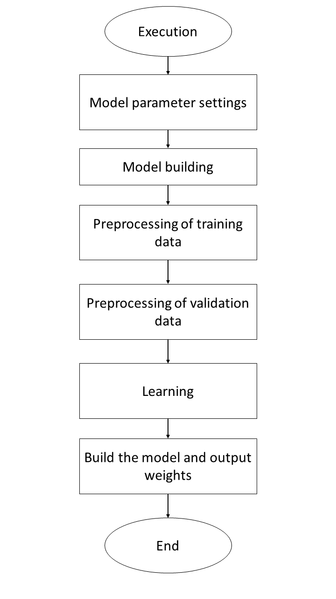

Explanation of the flow in the learning mechanism
'''''''''''''''''''''''''''''''''''''''''''''''''''''''''''''''

The fixed values selected in the model parameter setting and model building sections are used unchanged from the PredNet values.
The change is in the input size: PredNet selected the same fixed value as the training data generator, but we read the size from the hkl file and changed it so that it is the same size as the training data generator.
The training parameters have been changed.

* Modified learning parameters

  * nb_epoch：Number of epochs of learning (100)
  * batch_size：Batch size(1)
  * samples_per_epoch：Number of epoch sequences (5)
  * N_seq_val：Number of sequences of validation images (2)
  * nt：Number of images in one sequence (2)

※Sequence: Sequential images

These are embedded as fixed values. The numbers in parentheses are the current values. Currently, they are set at minimum values. However, depending on the memory status of the execution environment and the size of the input image, the data may not fit in memory and training may not be possible. Change the values according to the execution environment.

For preprocessing of training and validation data, PredNet's SequenceGenerator is used so that the information in the hkl file can be used for training.
One change to SequenceGenerator is that it was designed to always hold image data, so it now reads data only when training data is needed. This avoids a situation where memory is being used unnecessarily.

* Changes to SequenceGenerator

Since "keras.models.model.fit_generator" is used for training, it is possible to add processing when moving to the next stage of training at "next".
The image data was held in "self.X" but now only the path is held as "self.data_file" When image data needs to be retrieved in next, it is changed to read the image data within next.
PredNet's SequenceGenerator is available on `github <https://github.com/coxlab/prednet/blob/master/data_utils.py#L7>`_ .

Compression mechanism
====================================

The compression mechanism is divided into the following six major processes. This section explains what these processes actually do. The file is "compress.py".

1. Preparation for inference (image loading, model setting)
2. Inference
3. Error-bounded quantization
4. Density-based Spatial Encoding
5. Entropy Encoding
6. Output

Control flow of compression mechanism
'''''''''''''''''''''''''''''''''''''''''''''''''''''''''''''''

The flowchart of the compression mechanism is shown in the figure below.

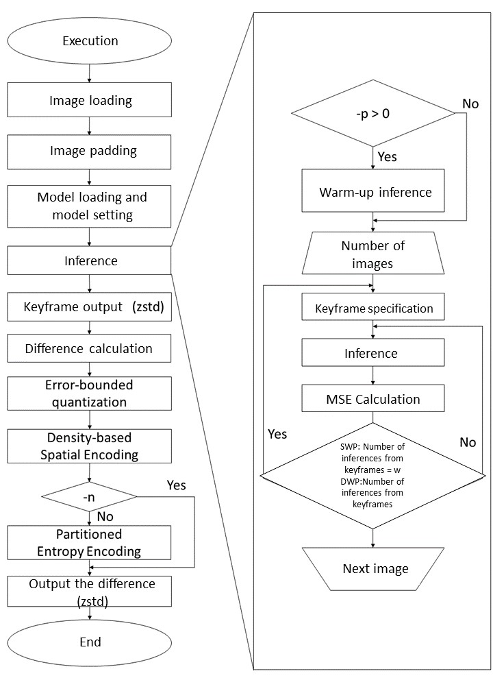

Explanation of flow in compression mechanism
'''''''''''''''''''''''''''''''''''''''''''''''''''''''''''''''

In the above figure, the control flow of the compression mechanism, the left side represents the entire process during compression, and the right side represents the process during inference.

Inference preparation
..........................

Explains the pre-processing flow up to "inference" in the control flow of the compression mechanism.

Image loading
..........................

Loads images using "Pillow" from images in the directory specified by the command line argument. When loaded, the images are sorted according to the python standard "sorted". It is assumed that the images will be arranged in chronological order.
Also, due to PredNet specifications, the images must be in a 5-dimensional array as shown below.

(Time series, Number of images, Vertical size, Horizontal size, Channel)

When dumping to hkl, multiple time series can be managed in a single file.
In this case, we will load one time series of images from a folder, so it will be a 4-dimensional array. Therefore, the information that it is one time series is added at the beginning to make it a 5-dimensional array.

Image padding
..........................

As mentioned in the "Padding" section above, PredNet specifications require that the image size be a multiple of 2^(number of layers in the model - 1). Therefore, padding is performed to adjust the image size.

Specification of implementation functions in image padding
^^^^^^^^^^^^^^^^^^^^^^^^^^^^^^^^^^^^^^^^^^^^^^^^^^^^^^^^^^^^^^^^^^^^^^^^^^^^^^^^^

The following functions are implemented in "data_utils.py".
Function name:data_padding(X_test)

Argument:
	X_test: loaded image array
Pass the height and width of the image to "padding_shape" below to get the size of the image after padding. Create a filled array with the size after padding, and assign the original image to the array to make it the array after padding.

Function name:padding_shape(height, width)

Argument:
   * height：Vertical size of image
   * width：Horizontal size of the image
Pass height and width separately to "padding_size" below to receive the size of each after padding. The values are combined into a tuple type and the value is returned.

Function name:padding_size(num)

Argument：
   * num：Size before padding

You can keep adding 8 to the tmp variable until the size of num is exceeded, and if the size of num is exceeded, that value can be used as the size after padding. The actual process is not a method of repeatedly adding 8, but rather dividing the size by 8 to determine how many times it will be exceeded, as described in the "Padding Implementation Function Specification" section above.
This is a fixed value because PredNet should be a multiple of 8 due to the number of layers. If the number of layers is changed, this value of 8 should also be changed.

Model Setting
..........................

The model is set up by reading the model structure and weights output by the "Learning Mechanism". Basically, the model setting is the same as the PredNet model setting, but the shape of "input" is partially changed. The number of images in one time series was set as a fixed value during training, but since it cannot be fixed during compression, this information is set to "None" and made variable.
After setting up the model, compare the image size with the input size to check if the model is supported. If it is not supported, the program will display the contents and terminate.

Inference
'''''''''''''''''''''''''''''''''

PredNet's default inference specification was to infer the next frame from the previous original image and repeat the process; the TEZIP paper was to infer from the inferred result image, so this system was re-specified as such.

Warm-up inference
..........................

Since PredNet is a type of LSTM model, it leverages previous inference information. Inference accuracy may be improved by inferring the first few frames from the previous source image and using them as a warm-up. Only the number of frames specified by the "-p" argument are inferred from the previous frame, and the warm-up is applied.
It is not to be included in the criteria for switching keyframes in the "SWP and DWP" section below.

SWP and DWP
..........................

Inferring the next frame from the inference result means that the accuracy will decrease step by step. In order to maintain some degree of accuracy, it is necessary to intersperse inference from the original image along the way. The methods are "Static Window-based Prediction (SWP)" and "Dynamic Window-based Prediction (DWP)".

* SWP

A fixed value specifies the number of images to be inferred from a single image. After the specified number of images have been inferred, the next inference is performed from the specified number of images, using the source image as the key frame for the next inference. This is repeated for all images.

* DWP

Set the Mean Square Error (MSE) threshold and switch keyframes if it is exceeded. The Mean Square Error (MSE) of the original image and the inferred result are calculated, and if the threshold is not exceeded, the process continues; if it is exceeded, the keyframe is switched. This is repeated for all images.

The execution flow is as follows.

1. Inference from keyframes
2. Calculate MSE
3. If the criteria (specified number of cards for SWP, threshold for DWP) are not exceeded, inference is performed from the inference result
4. Repeat②～③
5. If the criteria are exceeded, the previous values are stored in the "list". Then repeat ①～③
6. Repeat ①～⑤ for all pixels

The following figure shows the flow of keyframe switching. The implementation method is the same, with the only difference being the criteria for switching keyframes, so the switching is done with a single conditional branch.
The image that is actually output as a keyframe is the one in yellow. Images in blue are actually saved as black (0-fill) and are treated as almost nonexistent when compressed.
The inferred image (gray rectangle) of the location that fits the keyframe is also stored as black (0-filled).

.. image:: ./img/img28.png

Error-bounded quantization
..........................

It performs lossy processing on the image data to increase the compression ratio of the final image. The following four are implemented.

* abs
absolute error bound

* rel
relative bound ratio

* absrel
Use ranges that satisfy both "abs" and "rel" ranges

* pwrel
point wise relative error bound

These will be the methods used to define the acceptable range. The values in the range that meet the criteria are unified and quantized by the average value.

Image Padding Function specifications for implementation
^^^^^^^^^^^^^^^^^^^^^^^^^^^^^^^^^^^^^^^^^^^^^^^^^^^^^^^^^^^^^^^^^^^^^^^^^^^^^^^^^

Function name：error_bound(origine, diff, mode, value, GPU_FLAG, xp)

Argument:
   * origine：Array of original images
   * diff：Array of Differences
   * mode：Command line argument "-m" string
   * value：Value of command line argument "-b"
   * GPU_FLAG：Flag if the GPU is recognized or not
   * xp：Either "numpy" or "cupy" (Determined by GPU availability)

Examine the "-m" strings and determine the corresponding tolerance for each. After determining the tolerance range, quantization is performed. The values that satisfy the tolerance range are unified as the average of the upper and lower limits of the tolerance range.
If value is 0, no processing is performed as a specification of lossless compression, and diff is returned as is.

absolute error bound
^^^^^^^^^^^^^^^^^^^^^^^^^^^

For absolute error, the value entered for "-b" is used as is to determine the tolerance. The following figure shows an image.

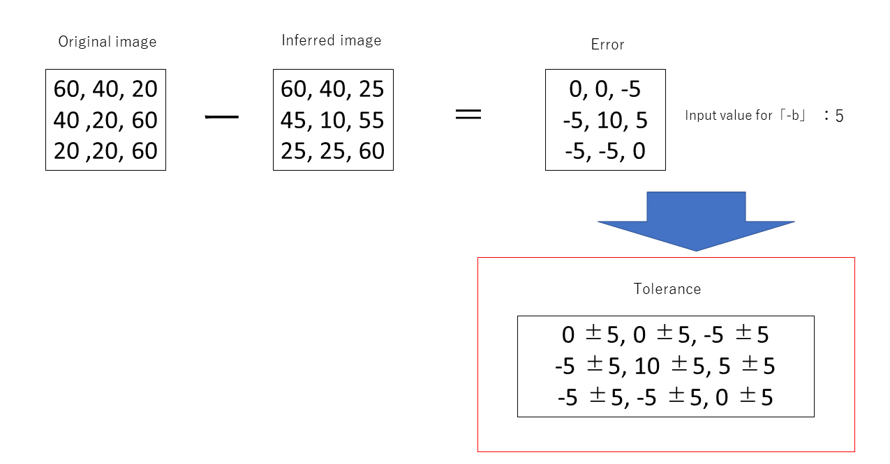

relative bound ratio
^^^^^^^^^^^^^^^^^^^^^^^^^^^

In the relative bound ratio, first find the error (absolute error), then find the maximum and minimum values of the original image. The maximum value minus the minimum value is then multiplied by the multiplier entered in "-b" to obtain the tolerance. The following is a formula of this content.

.. math::　Tolerance level = (Maximum value of original image – Minimum value of original image) × Magnification

The following figure shows an illustration of the relative bound ratio.

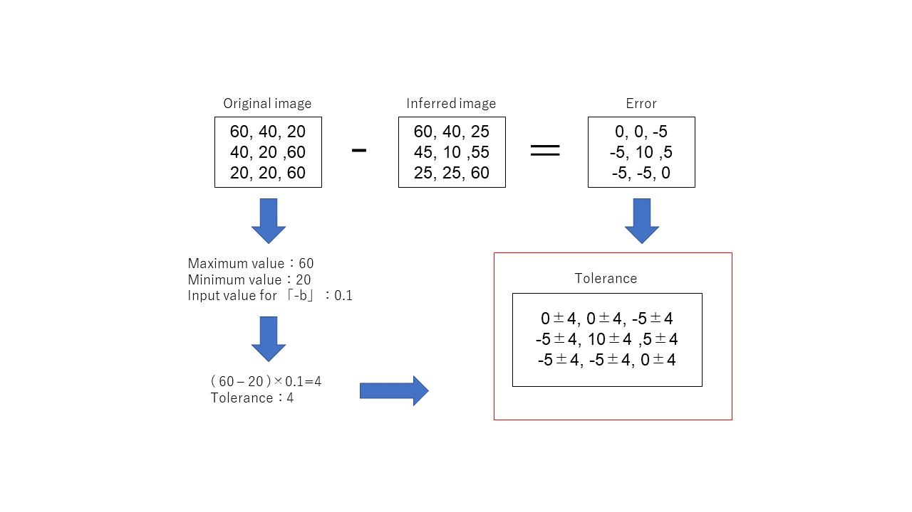

absrel
^^^^^^^^^^^^^^^^^^^^^^^^^^^

Use the one that satisfies the range of both abs described in the "absolute error bound" section above and rel described in the "relative bound ratio" section above. Satisfying both ranges means that the smaller value is used when the value's abs and rel values are compared.

Examples are as follows

+ Array value：a
+ Value of abs：b
+ Value of　rel：c

.. math:: 

   If b < c
   ・ Upper limit：a + b < a + c　In the case of the upper limit, the smaller one falls within both ranges, so a + b
   ・ Lower limit：a - b  > a - c　 Lower limit, since the larger value falls within both ranges, a - b

In fact, since the "rel" range is obtained by frame and by channel, it is highly likely that the "abs" range and the "rel" range are frequently interchanged within a single time series.

The following figure is an illustration of absrel, and the part of the function that determines the tolerance between abs and rel is omitted since it is found in the "absolute error bound" and "relative bound ratio" clauses.

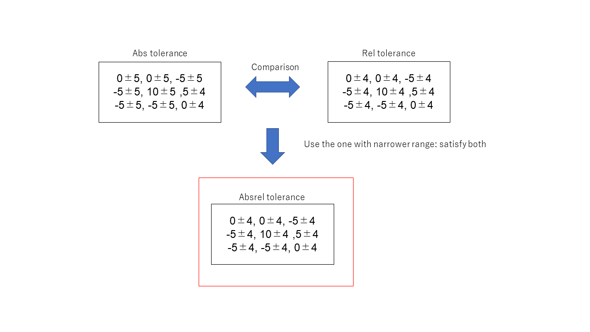

point wise relative error bound
^^^^^^^^^^^^^^^^^^^^^^^^^^^^^^^^^

point wise relative error bound determines the tolerance for each pixel. It determines the tolerance by applying the magnification factor specified by "-b" to the source image pixel by pixel. The image below is an illustration.

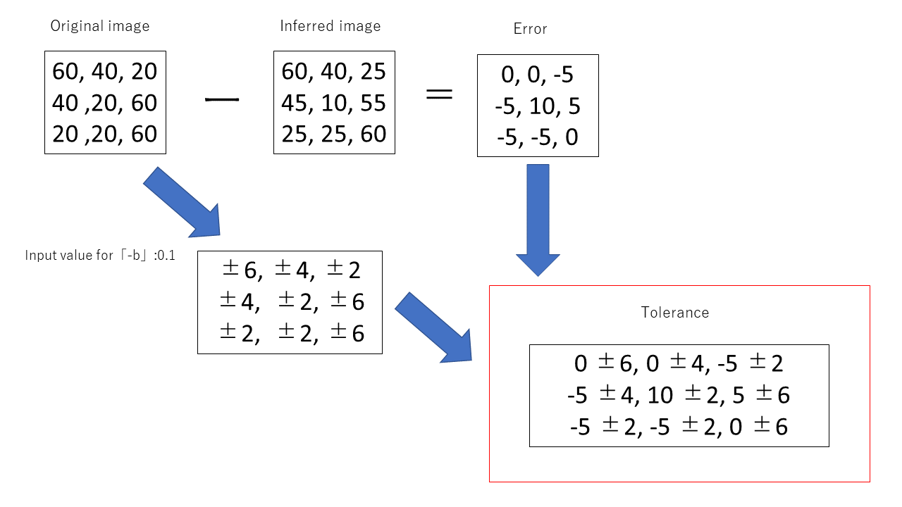

Quantization
^^^^^^^^^^^^^^^^^^^^^^^^^^^^^^^^^

Quantization is performed in the following flow. An illustration of the image is shown in the following figure. In the figure, the tolerance obtained by pwrel is used.

1. Use the tolerance obtained in any of the "absolute error bound" to "point wise relative error bound" sections above
2. Compare the tolerances of the pixels in turn and update them by adopting the upper and lower limits of the overlapping areas
3. When a value comes that does not fall within the tolerance range, the value up to that point is set to the value obtained by the following formula

.. math:: Value = (Upper limit + Lower limit) / 2

4. Use the following pixel tolerances as upper and lower limits
5. Repeat ②～④ until all pixels are completed

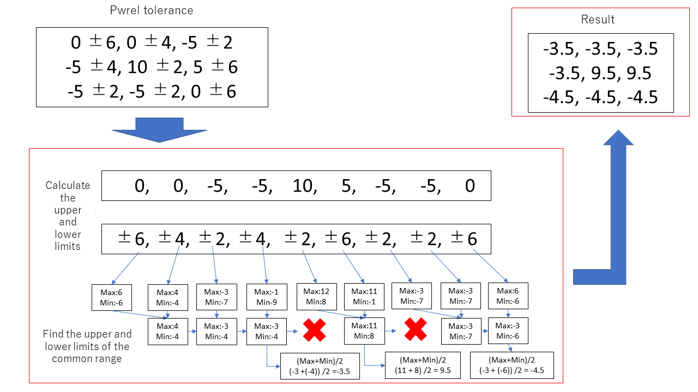

This process allows for compression so that the same values are continuous. This allows for a higher compression ratio when performing "Density-based Spatial Encoding," which will be explained later.

Density-based Spatial Encoding
......................................

Density-based Spatial Encoding finds the difference from the previous pixel. This process ensures that all consecutive values in the image are zero. This leads to a higher compression ratio for the "Entropy Encoding" process that follows.

The following figure shows an image of the process.

.. image:: ./img/img39.png

Specification of functions implementing Density-based Spatial Encoding
^^^^^^^^^^^^^^^^^^^^^^^^^^^^^^^^^^^^^^^^^^^^^^^^^^^^^^^^^^^^^^^^^^^^^^^^^^^^^^^^^^^^^^^^

Function name:finding_difference(arr)

Argument：
   * arr：Resulting array of "Error-bounded quantization"

For the implementation method, the input array minus the last value is subtracted from the input array minus the first value. This allows for parallel computation. Although there is another way to calculate the values by taking them out one by one, this method is implemented as an optimization for GPUs. The following figure shows an image of the implementation. A and B in the diagram represent the following

* A：Array of inputs excluding the last value
* B：Array of inputs excluding the first value

Entropy Encoding
..........................

Entropy Encoding converts high frequency values to low bit-count values. This leads to more values with smaller bit counts, which improves the compression ratio. However, when values are sparsely distributed, the compression ratio is not as high as it could be. In some cases, the size of the file may be larger than before Entropy Encoding. Therefore, Entropy Encoding can be optionally disabled. If "-n" is specified, this process is not performed.
The Entropy Encoding process is implemented in the following flow.

1. The difference array is converted to its value by finding the difference from "1600". The "1600" will be a number to ensure that values in the mapping table do not overlap with values in the mapping table indexes. (See Section "2" of "Two purposes for processing ①" below)
2. Create a mapping table sorted by value of frequency
3. The value of the difference array that matches the contents of the mapping table is converted to the value of the index of the mapping table

Processes ① and ② are implemented in the execution function, and ③ is implemented in the "replacing_based_on_frequency" function.

The processing of ① has two purposes.

1. Eliminate negative numbers

Negative numbers in the process of creating the mapping table will cause an error. To prevent this, the value is subtracted from "1600" and converted to positive numbers only.

2. Ensure that values in the mapping table do not overlap with values in the index

Since the iterative process compares the mapping table and difference array in sequence, once a value is converted, it may be subject to conversion at a later iteration. To avoid this, convert to the difference from "1600".

* Before difference from "1600"
   * Range of values in mapping table：-510～510
   * Index Range：0～1020

↑The above is duplicated 0-510

* After difference from "1600"
   * Range of values in mapping table：1090～2110
   * Index Range：0～1020

↑No duplication

The following diagram illustrates the image of the execution process for ② and ③. The input values are used as a simple example. (In reality, values between 1090 and 2110 are entered.)

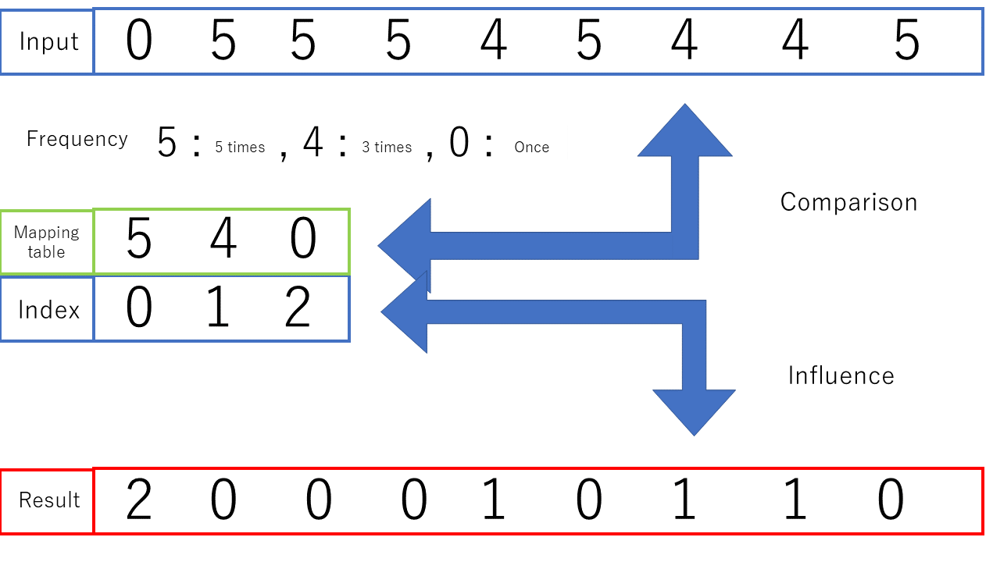

Specifications of functions implemented by Entropy Encoding
^^^^^^^^^^^^^^^^^^^^^^^^^^^^^^^^^^^^^^^^^^^^^^^^^^^^^^^^^^^^^^^^^^^^

Function name：replacing_based_on_frequency(arr, table, xp)

Argument：
   * arr：Result array of "Density-based Spatial Encoding"
   * table：Mapping table
   * xp：Either "numpy" or "cupy" (determined by GPU availability)

The table is converted from a list type to an xp array before being put into the function. This is because when cupy is used, if table is still in list type, data exchange between GPU and CPU will occur and processing will be heavy.
Refer to the previous image of the execution process for the processing flow. To achieve this, xp.where compares the mapping table and array values and converts the array value to an index number if there is a match.

Output
..........................

After the compression mechanism is executed, the following three files are output.
The ".dat" format files are compressed using the "zstd" library before output.

* Text file containing the name of the image before compression(filename.txt)
* Key frame file（key_frame.dat）
* Difference between real image and inferred result（entropy.dat）

"filename.txt" extracts the image name from the path when the image is loaded and saves it in the standard python "sorted" order. This is because the name filename information is needed for decompression.
"key_frame.dat" stores the key frame images. The non-keyframe portions are zero-filled and are assumed to be of negligible size when compressed.
The "entropy.dat" file stores the data obtained by applying "Error-bounded quantization", "Density-based Spatial Encoding", and "Entropy Encoding" to the difference between the original image and the result of the "inference" described earlier. The following table shows the results. The following information is embedded at the end of the file. This information is necessary to reproduce the inference at the time of compression when decompressing.

* Number of sheets used for warm-up inference
* Shape of keyframes(Number of images, Horizontal and vertical size, Number of channels)
* Mapping table created by "Entropy Encoding"

For the mapping tables, they are embedded in the following order.

1. Mapping table
2. Length of mapping table

Since there are cases where Entropy Encoding is not performed with "-n", in such cases "-1" is placed in the length portion of the mapping table to indicate that Entropy Encoding was not performed during decompression.

Decompression mechanism
====================================

The decompression mechanism is divided into the following five major processes. From here, we will explain what these processes actually do. The file is "decompress.py".

* Inference preparation(Keyframe recovery・Model setting・Information acquisition during compression)
* Entropy Decoding
* Density-based Spatial Decoding
* Output

Control flow of the decompression mechanism
'''''''''''''''''''''''''''''''''''''''''''''''''''''''''''''''

The flowchart of the decompression mechanism is shown in the figure below.

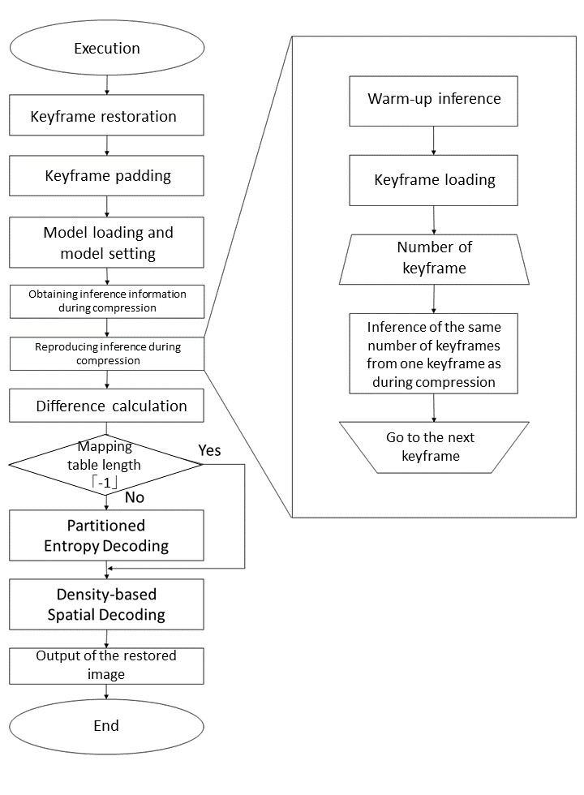

Flow description of the decompression mechanism
'''''''''''''''''''''''''''''''''''''''''''''''''''''''''''''''

The control flow of the decompression mechanism in the figure above shows the entire process during decompression on the left side and the process during inference on the right side.

Inference preparation
..........................

Before the decompression process, some preprocessing is performed.

Model Setting
^^^^^^^^^^^^^^^^^^^^^^^^^^^^^^^^^^^^^^^^^^^^

Model setting during compressionSet the model in the same way as in "Model Setting".

Keyframe Recovery
^^^^^^^^^^^^^^^^^^^^^^^^^^^^^^^^^^^^^^^^^^^^

After restoring the keyframes output during compression with zstd, they are converted to a numpy array with the same data type as during compression. Then, the shape embedded in "entropy.dat" is extracted and converted. At this time, the value of the "-p" command line argument embedded at the time of compression is also extracted.
Images that are not keyframes are filled with zeros, so "numpy.all" extracts those that contain non-zeros and extracts the index of the keyframe.

Key frame padding
^^^^^^^^^^^^^^^^^^^^^^^^^^^^^^^^^^^^^^^^^^^^

The same process as "image padding" is applied to key frames for padding.

Reproduce inference during compression
....................................................

The following flow reproduces the inference at the time of compression.
1. Inference from keyframes by the number of "-p" taken out by "Keyframe Recovery".
2. Inference from keyframes
3. Inference from inference results until the next keyframe arrives
4. Return to ① when the next key frame arrives.
5. ①～④ is repeated

The switching of ④ is performed repeatedly using the keyframe indexes retrieved in "Keyframe Restoration".

Entropy Decoding
..........................

Here, the results of "Density-based Spatial Encoding" are restored. To do so, we read entropy.dat and restore the difference array and the mapping table created by the embedded "Entropy Encoding". The restoration is then performed according to the procedure in "Implementation Function Specification for Decompression Mechanism". If the length of the mapping table is "-1", it means that Entropy Encoding is not performed, so this process is not executed.

Specification of functions to be implemented in Entropy Decoding
^^^^^^^^^^^^^^^^^^^^^^^^^^^^^^^^^^^^^^^^^^^^^^^^^^^^^^^^^^^^^^^^^^^^^^^^^^^^^^^^^^^^^^^^

Function name：replacing_based_on_frequency(arr, table, xp)

Argument：
   * arr：Resulting array of "Density-based Spatial Encoding"
   * table：Mapping table
   * xp：Either "numpy" or "cupy" (determined by GPU availability)

In "Entropy Encoding," the mapping table and array values were compared, and if a match was found, the array value was converted to an index number. Conversely, it compares the array value to the index in the mapping table and converts the array value to the value in the mapping table if there is a match. As with "Entropy Encoding," this is also implemented using xp.where. An image diagram is shown below.

In addition, to avoid overlap between the value in the mapping table and the value of the index, the difference from "1600" was determined and stored in the mapping table, so the original value is restored by determining the difference from "1600" after the function is executed.
In addition, to avoid overlap between the value in the mapping table and the value of the index, the difference from "1600" was determined and stored in the mapping table, so the original value is restored by determining the difference from "1600" after the function is executed.

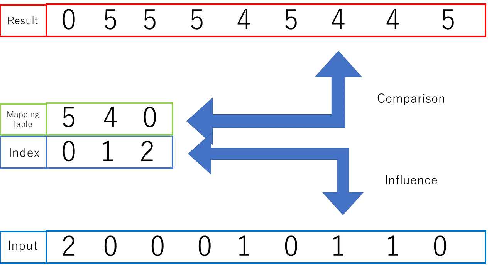

Density-based Spatial Decoding
..........................

Here the results of "Error-bounded quantization" are restored.
"Density-based Spatial Encoding" outputs the difference from the previous value. When restoring, the values are referenced and calculated one by one and restored using the previous result. Therefore, it is no longer possible to process the images in parallel as shown in the "Implementation Function Specification for Density-based Spatial Encoding" section.

Specification of Implementation Functions in Entropy Decoding
^^^^^^^^^^^^^^^^^^^^^^^^^^^^^^^^^^^^^^^^^^^^^^^^^^^^^^^^^^^^^^^^^^^^^^^^^^^^^^^^^^^^^^^^

Function name：finding_difference(arr)

Argument：
 *	arr：Resulting array of "Entropy Decoding"

The values are looked at one by one in sequence, and the original value is restored by subtracting the value at the next index. The following figure is an illustration of the implementation.

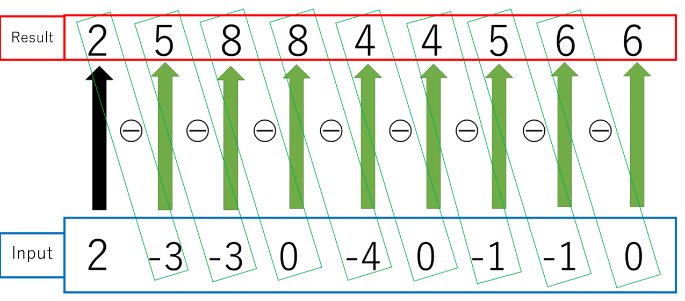

Output
..........................

After the decompression mechanism is executed, the image file before compression is output. Name the image file according to filename.txt, which contains the name of the image file that was saved during compression. The "Pillow" library is used to output the image.

Use of GPU (cupy) and CPU (numpy)
====================================

For the post-inference processing of the compression/decompression mechanism, we basically implemented it to be processed in parallel, assuming processing on a GPU. However, some of the calculations used the result of one previous element and could not be parallelized. Such processes are more likely to be slower when executed on a GPU, so they are executed on a CPU. The following is the classification.

Processes to be executed on GPU (cupy)
'''''''''''''''''''''''''''''''''''''''''''''''''''''''''''''''

* From "absolute error bound" to "point wise relative error bound": process to find the acceptable range of the error bound mechanism
* Density-based Spatial Encoding
* Entropy Encoding
* Entropy Decoding

Processes to be executed by CPU (numpy)
'''''''''''''''''''''''''''''''''''''''''''''''''''''''''''''''

* Quantization process
* Density-based Spatial Decoding
